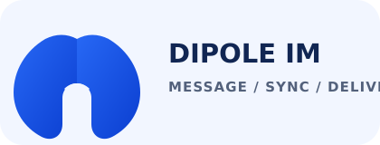
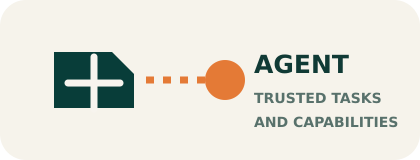

<p align="center">
  
</p>

<p align="center">
  A modern, event-driven collaboration platform for real-time messaging and governed Agent workflows.
</p>

<p align="center">
  <a href="#quick-start">Quick start</a> &middot;
  <a href="docs/README.md">Documentation</a> &middot;
  <a href="services/README.md">Services</a> &middot;
  <a href="CONTRIBUTING.md">Contributing</a>
</p>

## Overview

Dipole provides a real-time IM core with a gradual path to independently deployable services. Go owns IM domain consistency, Kafka carries domain events and projections, and SQLC keeps the MySQL access layer explicit. A TypeScript Agent Runtime integrates through versioned capability contracts and remains fail-closed for privileged paths.

<p align="center">
  
  &nbsp;&nbsp;&nbsp;&nbsp;
  
</p>

| Area | Current responsibility |
| --- | --- |
| **IM Core** | Authentication, users, contacts, groups, messages and conversations in Go. |
| **Gateway and delivery** | HTTP/WebSocket access, presence, routing and realtime delivery boundaries. |
| **Event and data** | Kafka events, MySQL metadata, Redis realtime state, MinIO objects, with Cassandra and Elasticsearch rollout gates. |
| **Agent Runtime** | TypeScript tasks, ExecutionContext, Capability Policy, Context Compiler and Temporal workflows. |

## Architecture

```text
Client -- HTTP / WebSocket --> Gateway --> Core / Message
                                         |        |
                                         |        +--> MySQL + transactional outbox
                                         v
                                       Kafka
                         +---------------+---------------+
                         |               |               |
                       Sync            Search       Agent Runtime
                         |               |               |
                   Timeline store   Elasticsearch   Temporal / MCP
```

The repository evolves through reversible slices: service contracts precede deployment extraction, and storage migrations use verification and rollback gates. See the [architecture overview](docs/architecture/PLATFORM-EVOLUTION-PLAN.md) for scope, evidence and deferred work.

## Highlights

- **Ordered sync model:** conversation sequence, read sequence and per-device cursor contracts support incremental synchronization.
- **Reliable event boundary:** transactional outbox, idempotent message handling and explicit Kafka projection ownership.
- **Portable data access:** versioned migrations and `database/sql + sqlc`; GORM is retired from the production data path.
- **Large-object workflow:** MinIO multipart upload supports resumable sessions, reconciliation and lifecycle cleanup.
- **Governed Agent execution:** trusted execution context, capability policy, durable Temporal tasks and owner-reviewed Memory promotion.

## Quick Start

### Prerequisites

- Docker Engine with Compose v2
- Go version declared in [`go.mod`](go.mod)
- Node.js version declared by [`frontend/.nvmrc`](frontend/.nvmrc) for the web client

### Run the local stack

```bash
docker compose up -d mysql redis kafka
go run ./cmd/tools/migrate -direction up
go run ./cmd/services/core
```

Run the web client in another terminal:

```bash
cd frontend
npm ci
npm run dev
```

For the isolated microservice smoke topology, use:

```bash
scripts/smoke-microservices-lite.sh
```

The script creates and removes an isolated Compose project. Remote deployment and load-testing procedures live in the [operations documentation](docs/operations/REMOTE-DEV-DEPLOYMENT.md).

## Verify

```bash
scripts/check-go.sh
scripts/check-sqlc.sh
scripts/check-proto.sh
scripts/check-compose.sh
scripts/check-architecture-docs.sh
scripts/check-service-layout.sh
```

For frontend checks:

```bash
cd frontend
npm run test:toolchain
npm test
npm run build
```

## Documentation

- [Documentation index](docs/README.md): architecture, data, operations and frontend design.
- [Service catalog](services/README.md): Go, TypeScript and C++ service boundaries.
- [Contracts](contracts/README.md): versioned inter-service protocols.
- [Learning and interview index](docs/guides/PROJECT-LEARNING-AND-INTERVIEW.md): choose the IM or Agent project narrative.
- [IM project material](docs/guides/DIPOLE-IM-LEARNING-AND-INTERVIEW.md): IM system design and interview evidence.
- [Agent project material](docs/guides/DIPOLE-AGENT-LEARNING-AND-INTERVIEW.md): Agent Runtime design and interview evidence.
- [Changelog](CHANGELOG.md): rolling project updates.

## Contributing

Read [CONTRIBUTING.md](CONTRIBUTING.md) before opening a change. Each capability slice should include focused tests, documentation updates, a changelog entry and a rollback boundary where it changes runtime behavior.

## License

Dipole is released under the [MIT License](LICENSE).
