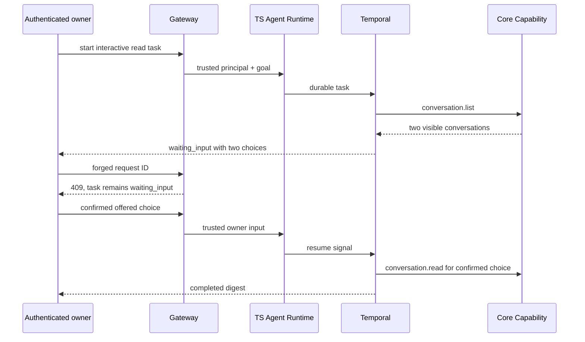

# Agent Read-Scope Confirmation Receipt

This receipt records a disposable Remote GPU observation of the interactive
read-shadow flow on clean revision `d591bc7592b3974c6ec33425371f66fd9d3e29ea`.
The isolated Compose project exposed Gateway only on loopback and retained the
default read-only Agent authority.

## Observed Flow

The Gateway accepted the authenticated task start (`202`). The Task paused in
`waiting_input` with two discovered choices. A forged request ID returned
`409` and preserved that state. The valid, offered choice returned `202`; the
Task and Run then completed. Persistent trajectory checks show exactly one
`conversation.list`, one authorized `conversation.read` for the selected
conversation, zero reads for the other discovered conversation, and one
`conversation_digest` Artifact. See [`receipt.json`](receipt.json).

## Boundary

This is a controlled two-conversation functional receipt, not an independent
evaluation window. It does not support claims about overall task success,
model quality, latency, shared-environment reliability, active write safety,
MCP, Memory, or public availability. Test account, token, task, run, message,
and conversation identifiers remain in the protected Remote GPU workspace.
