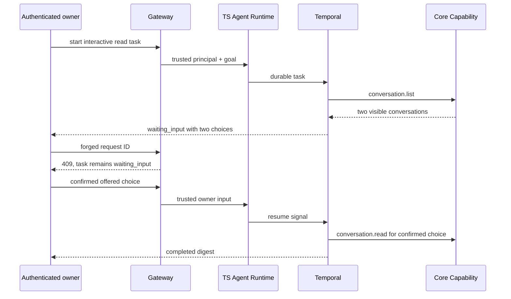

# Agent Read-Scope Confirmation Receipt

This receipt records a disposable Remote GPU observation of the interactive
read-shadow flow on clean revision `d591bc7592b3974c6ec33425371f66fd9d3e29ea`.
The isolated Compose project exposed Gateway only on loopback and retained the
default read-only Agent authority.

## Observed Flow

The Gateway accepted the authenticated task start (`202`). The Task paused in
`waiting_input` with two discovered choices. A forged request ID returned
`409` and preserved that state. The valid, offered choice returned `202`; the
Task and Run then completed. Persistent trajectory checks show exactly one
`conversation.list`, one authorized `conversation.read` for the selected
conversation, zero reads for the other discovered conversation, and one
`conversation_digest` Artifact. See [`receipt.json`](receipt.json).

The same isolated fixture also exercised owner cancellation from
`waiting_input`. Gateway accepted `user_cancelled` (`202`), and both Task and
Run converged to `cancelled`. The pending read remains a planned trajectory
row for replay consistency, while its completed and authorized read counts
are both zero; only the discovery step completed.

## Expiry Check

The Agent image was then updated to `d60ace70` on the same isolated
`d591bc75` service topology, with the confirmation TTL reduced to 2 seconds
only for this check. Gateway again accepted the authenticated start (`202`).
The final owner-scoped task query and its Timeline returned `200`; Task and
Run converged to `cancelled/input_expired`. The Timeline contained five
append-only lifecycle events. The `input_expired` transition is emitted only
from a pending `waiting_input` state, so it is durable evidence that an
unanswered scope confirmation expired even though the creation projection has
a brief `404` visibility window immediately after admission.

Persistent aggregation recorded one completed `conversation.list`, one
planned `conversation.read`, and zero completed or authorized reads. The
short TTL was removed after the check; the candidate returns to its default
15-minute confirmation TTL.

## Boundary

This is a controlled two-conversation functional receipt, not an independent
evaluation window. It does not support claims about overall task success,
model quality, latency, shared-environment reliability, active write safety,
MCP, Memory, or public availability. It also does not substitute for combined
Worker/Core/EventLedger lease fault injection. Test account, token, task, run,
message, and conversation identifiers remain in the protected Remote GPU
workspace.
