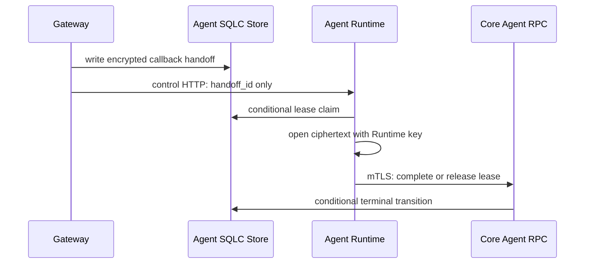

# Agent OAuth Callback Handoff Transport v1

## Status

This is a release gate for a future default-closed implementation. It defines
two separate trusted channels and forbids a callback route until both are
implemented and drilled.

Gateway-to-Runtime control HTTP authenticates `dipole-gateway` with the
existing private service secret. It accepts only a strict handoff ID, request
ID and trace ID. It must never accept or return an authorization code, state,
PKCE verifier, ciphertext, private key, token or user-controlled principal.
The v1 notification is `POST /internal/v1/agent/oauth/callback-handoffs` with
the exact JSON body `{"handoff_id":"..."}` and a `202 Accepted` response.
The Gateway client permits plaintext HTTP only for a loopback Runtime target;
all other targets require HTTPS.

Runtime-to-Core uses the existing Agent Capability RPC mTLS identity
`dipole-agent`. Core recovers the handoff owner and immutable binding from its
own store. Runtime may submit the handoff ID, its unique lease owner, and a
terminal action only; it cannot supply owner, issuer, redirect URI or code.

## State Actions

| Action | Caller | Required condition | Result |
| --- | --- | --- | --- |
| `claim` | `dipole-agent` Runtime | recorded or expired lease, unexpired handoff | fresh lease and opaque record |
| `complete` | `dipole-agent` Runtime | matching unexpired lease after successful exchange | `exchanged` terminal state |
| `release` | `dipole-agent` Runtime | matching unexpired lease, retryable exchange failure | `callback_recorded` |

Core must make every action conditional. Duplicate control notifications are
allowed; duplicate token exchanges are prevented by a successful terminal
transition plus provider idempotency policy. A Runtime restart cannot recover
plaintext from memory and must reclaim the persisted ciphertext by lease.

## Failure Matrix

| Failure | Required behavior |
| --- | --- |
| Gateway cannot notify Runtime | record remains `callback_recorded`; no second browser callback needed |
| Runtime crashes before claim | record remains claimable |
| Runtime crashes during exchange | lease expiry permits a bounded retry; provider policy determines whether exchange is safe to retry |
| Runtime loses mTLS/Core access | no terminal transition; ciphertext remains unavailable outside Runtime |
| Wrong caller, owner, issuer, redirect or browser binding | callback rejected before handoff write |
| Expired handoff | claim and terminal transition fail closed; retention job purges ciphertext |

Kafka and Temporal may carry a low-sensitivity handoff ID as a later retry
signal, but cannot carry a ciphertext or authorization material. A direct
Gateway-to-Runtime payload is mandatory for the initial notification so a
failed event consumer cannot become the only source of callback progress.

## Required Tests Before Route Registration

1. Gateway control client rejects every sensitive field and verifies service identity.
2. Runtime rejects missing/incorrect service secret and invalid handoff ID.
3. Core mTLS RPC rejects Gateway identity and owner supplied by Runtime.
4. Duplicate notification, expired lease takeover, Runtime restart and Core outage preserve exactly one terminal exchange.
5. Provider owner reviews retry semantics and refresh/revoke retention before any callback HTTP flag is enabled.
