# Dipole 架构设计

> 详细的系统架构文档——涵盖每个微服务、每个模块、数据流与部署拓扑

---

## 目录

- [1. 系统总览](#1-系统总览)
- [2. 微服务详解](#2-微服务详解)
  - [2.1 Core](#21-core)
  - [2.2 Gateway](#22-gateway)
  - [2.3 Message](#23-message)
  - [2.4 Sync](#24-sync)
  - [2.5 Search & Search Indexer](#25-search--search-indexer)
  - [2.6 Agent Runtime (TypeScript)](#26-agent-runtime-typescript)
- [3. 前端架构](#3-前端架构)
- [4. 数据模型](#4-数据模型)
- [5. 核心数据流](#5-核心数据流)
  - [5.1 消息发送与投递](#51-消息发送与投递)
  - [5.2 Agent Task 生命周期](#52-agent-task-生命周期)
  - [5.3 Agent 群组 @回复](#53-agent-群组-回复)
- [6. 部署架构](#6-部署架构)
- [7. gRPC 契约总览](#7-grpc-契约总览)
- [8. Kafka 事件拓扑](#8-kafka-事件拓扑)

---

## 1. 系统总览

### 1.1 微服务拓扑

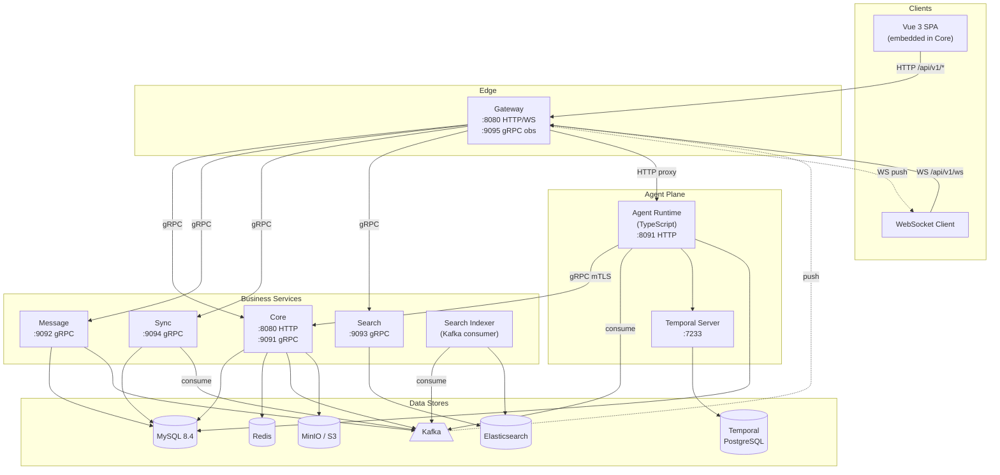
```mermaid
graph TB
    subgraph Clients
        WebApp["Vue 3 SPA<br/>(embedded in Core)"]
        WSClient["WebSocket Client"]
    end

    subgraph Edge
        GW["Gateway<br/>:8080 HTTP/WS<br/>:9095 gRPC obs"]
    end

    subgraph Business Services
        CORE["Core<br/>:8080 HTTP<br/>:9091 gRPC"]
        MSG["Message<br/>:9092 gRPC"]
        SYNC["Sync<br/>:9094 gRPC"]
        SEARCH["Search<br/>:9093 gRPC"]
        SIDX["Search Indexer<br/>(Kafka consumer)"]
    end

    subgraph Agent Plane
        ART["Agent Runtime<br/>(TypeScript)<br/>:8091 HTTP"]
        TEMP["Temporal Server<br/>:7233"]
    end

    subgraph Data Stores
        MySQL[(MySQL 8.4)]
        Redis[(Redis)]
        Kafka[/Kafka\]
        MinIO[(MinIO / S3)]
        ES[(Elasticsearch)]
        TPDB[(Temporal<br/>PostgreSQL)]
    end

    WebApp -->|HTTP /api/v1/*| GW
    WSClient -->|WS /api/v1/ws| GW

    GW -->|gRPC| CORE
    GW -->|gRPC| MSG
    GW -->|gRPC| SYNC
    GW -->|gRPC| SEARCH
    GW -->|HTTP proxy| ART

    CORE --> MySQL
    CORE --> Redis
    CORE --> Kafka
    CORE --> MinIO

    MSG --> MySQL
    MSG --> Kafka

    SYNC --> MySQL
    SYNC -->|consume| Kafka

    SEARCH --> ES
    SIDX -->|consume| Kafka
    SIDX --> ES

    ART -->|gRPC mTLS| CORE
    ART -->|consume| Kafka
    ART --> TEMP
    ART --> MySQL

    TEMP --> TPDB

    Kafka -.->|push| GW
    GW -.->|WS push| WSClient
```

### 1.2 通信协议矩阵

| 源 → 目标 | 协议 | 用途 |
|-----------|------|------|
| Client → Gateway | HTTP REST, WebSocket | 所有客户端 API |
| Gateway → Core | gRPC `:9091` | 用户/群组/会话/Agent 能力 |
| Gateway → Message | gRPC `:9092` | 消息发送/历史 |
| Gateway → Sync | gRPC `:9094` | 收件箱同步 |
| Gateway → Search | gRPC `:9093` | 全文搜索 |
| Gateway → Agent Runtime | HTTP proxy | 任务控制/MCP |
| Agent Runtime → Core | gRPC mTLS `:9091` | Agent 治理 RPC |
| Message → Kafka | Produce | `message.direct.created`, `message.group.created` |
| Kafka → Gateway | Consume | 实时消息推送 |
| Kafka → Agent Runtime | Consume | 入站触发事件 |
| Kafka → Sync | Consume | 收件箱投影 |
| Kafka → Search Indexer | Consume | 搜索索引 |
| Agent Runtime → Temporal | SDK | 工作流编排 |

---

## 2. 微服务详解

### 2.1 Core

**入口：** `cmd/services/core/main.go`

**职责：** 身份认证、社交图谱、会话状态、文件元数据、Agent 治理 gRPC

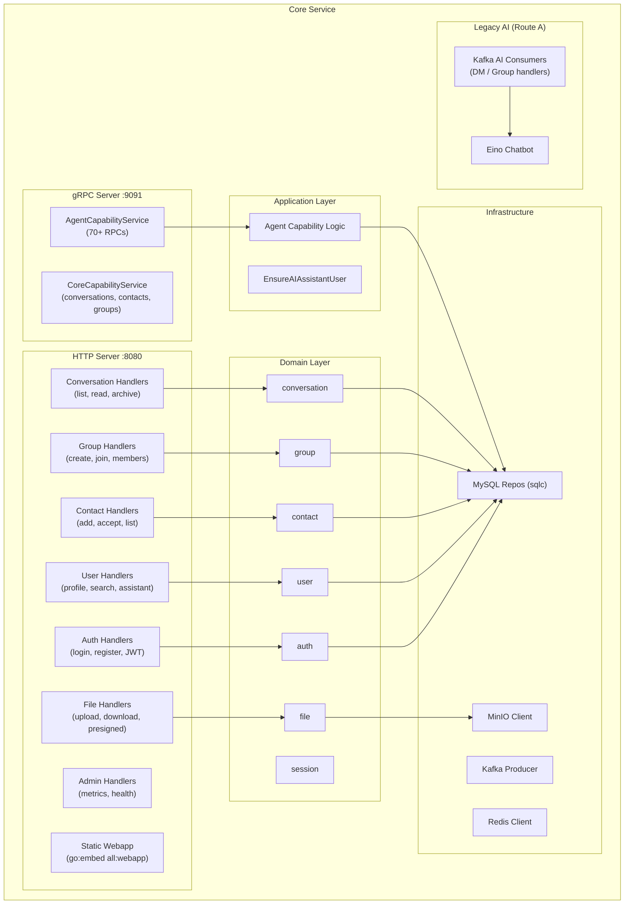
```mermaid
graph TB
    subgraph "Core Service"
        subgraph "HTTP Server :8080"
            AUTH_H["Auth Handlers<br/>(login, register, JWT)"]
            USER_H["User Handlers<br/>(profile, search, assistant)"]
            CONTACT_H["Contact Handlers<br/>(add, accept, list)"]
            GROUP_H["Group Handlers<br/>(create, join, members)"]
            FILE_H["File Handlers<br/>(upload, download, presigned)"]
            CONV_H["Conversation Handlers<br/>(list, read, archive)"]
            ADMIN_H["Admin Handlers<br/>(metrics, health)"]
            STATIC["Static Webapp<br/>(go:embed all:webapp)"]
        end

        subgraph "gRPC Server :9091"
            CORE_CAP["CoreCapabilityService<br/>(conversations, contacts, groups)"]
            AGENT_CAP["AgentCapabilityService<br/>(70+ RPCs)"]
        end

        subgraph "Domain Layer"
            D_AUTH["auth"]
            D_USER["user"]
            D_CONTACT["contact"]
            D_GROUP["group"]
            D_FILE["file"]
            D_CONV["conversation"]
            D_SESSION["session"]
        end

        subgraph "Application Layer"
            APP_AI["EnsureAIAssistantUser"]
            APP_AGENT["Agent Capability Logic"]
        end

        subgraph "Infrastructure"
            MYSQL_R["MySQL Repos (sqlc)"]
            KAFKA_P["Kafka Producer"]
            REDIS_C["Redis Client"]
            MINIO_C["MinIO Client"]
        end

        subgraph "Legacy AI (Route A)"
            EINO["Eino Chatbot"]
            KAFKA_AI["Kafka AI Consumers<br/>(DM / Group handlers)"]
        end
    end

    AUTH_H --> D_AUTH
    USER_H --> D_USER
    CONTACT_H --> D_CONTACT
    GROUP_H --> D_GROUP
    FILE_H --> D_FILE
    CONV_H --> D_CONV
    AGENT_CAP --> APP_AGENT

    D_AUTH --> MYSQL_R
    D_USER --> MYSQL_R
    D_CONTACT --> MYSQL_R
    D_GROUP --> MYSQL_R
    D_FILE --> MINIO_C
    D_CONV --> MYSQL_R

    APP_AGENT --> MYSQL_R
    KAFKA_AI --> EINO
```

**Agent gRPC RPC 分组（70+ 端点）：**

| RPC 组 | 代表性端点 | 用途 |
|--------|-----------|------|
| Admission | `AdmitRun`, `AdmitTask` | 任务/运行准入 |
| Policy | `ProjectAgentState`, `GetApprovedCapabilities` | 能力投影 |
| Approval | `RequestApproval`, `ConsumeApproval`, `ResolveApproval` | 审批流 |
| Invocation | `BeginToolInvocation`, `FinishToolInvocation`, `RecordModelCall` | 工具审计 |
| Message Command | `ExecuteMcpMessageCommand` | 受治理消息发送 |
| Context | `ResolveMcpContext`, `ReadConversation` | 上下文获取 |
| Memory | `WriteMemory`, `ReadMemories`, `ReviewMemoryCandidate` | 记忆管理 |
| Subscription | `CreateSubscription`, `ListSubscriptions` | 事件订阅 |
| Definition | `CreateDefinition`, `UpdateDefinition` | Agent 定义 |
| Artifact | `CreateArtifact`, `GetArtifact` | 产出物管理 |
| Timeline | `AppendTimelineEvent`, `GetTimeline` | 任务时间线 |
| Promotion | `GrantPromotion`, `ReviewPromotion`, `GetActiveRuntime` | 运行时晋升 |
| OAuth | `InitOAuthHandoff`, `CompleteOAuthTransaction` | 外部服务认证 |

### 2.2 Gateway

**入口：** `cmd/services/gateway/main.go`

**职责：** 客户端边缘，协议转换，WebSocket 实时推送，Agent Runtime HTTP 代理

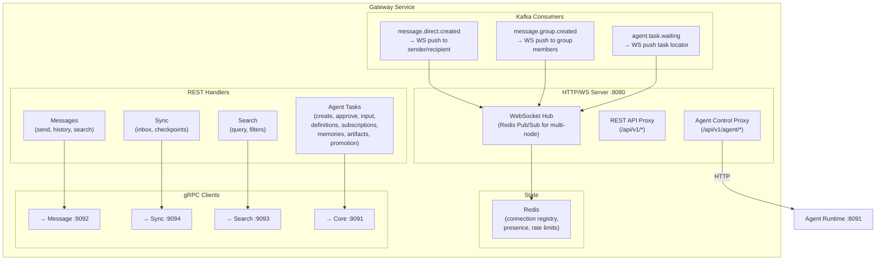
```mermaid
graph TB
    subgraph "Gateway Service"
        subgraph "HTTP/WS Server :8080"
            WS_HUB["WebSocket Hub<br/>(Redis Pub/Sub for multi-node)"]
            REST_PROXY["REST API Proxy<br/>(/api/v1/*)"]
            AGENT_PROXY["Agent Control Proxy<br/>(/api/v1/agent/*)"]
        end

        subgraph "REST Handlers"
            H_MSG["Messages<br/>(send, history, search)"]
            H_SYNC["Sync<br/>(inbox, checkpoints)"]
            H_SEARCH["Search<br/>(query, filters)"]
            H_AGENT["Agent Tasks<br/>(create, approve, input,<br/>definitions, subscriptions,<br/>memories, artifacts, promotion)"]
        end

        subgraph "Kafka Consumers"
            K_DIRECT["message.direct.created<br/>→ WS push to sender/recipient"]
            K_GROUP["message.group.created<br/>→ WS push to group members"]
            K_TASK["agent.task.waiting<br/>→ WS push task locator"]
        end

        subgraph "gRPC Clients"
            C_CORE["→ Core :9091"]
            C_MSG["→ Message :9092"]
            C_SEARCH["→ Search :9093"]
            C_SYNC["→ Sync :9094"]
        end

        subgraph "State"
            REDIS_STATE["Redis<br/>(connection registry,<br/>presence, rate limits)"]
        end
    end

    WS_HUB --> REDIS_STATE
    H_MSG --> C_MSG
    H_SYNC --> C_SYNC
    H_SEARCH --> C_SEARCH
    H_AGENT --> C_CORE
    AGENT_PROXY --> |HTTP| ART_EXT["Agent Runtime :8091"]
    K_DIRECT --> WS_HUB
    K_GROUP --> WS_HUB
    K_TASK --> WS_HUB
```

**关键设计点：**
- **无数据库** —— Gateway 不拥有任何持久化表
- **WebSocket 推送** —— Kafka 消费者收到消息事件后，通过 Redis Pub/Sub 找到目标用户的 WS 连接并推送
- **Agent 代理** —— Gateway 透传 Agent 相关请求到 Agent Runtime HTTP 服务器

### 2.3 Message

**入口：** `cmd/services/message/main.go`

**职责：** 消息命令路径——发送、历史查询、幂等性保证、序号分配、Outbox 可靠发布

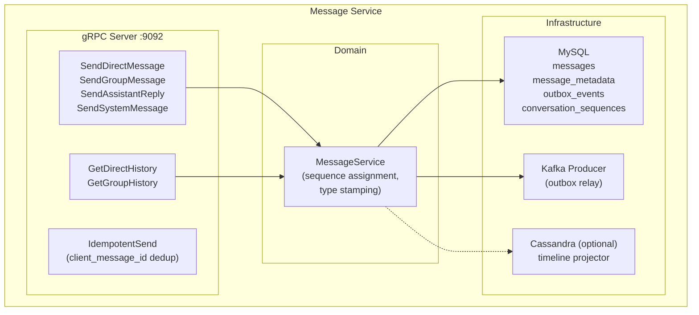
```mermaid
graph TB
    subgraph "Message Service"
        subgraph "gRPC Server :9092"
            SEND["SendDirectMessage<br/>SendGroupMessage<br/>SendAssistantReply<br/>SendSystemMessage"]
            HISTORY["GetDirectHistory<br/>GetGroupHistory"]
            IDEMPOTENT["IdempotentSend<br/>(client_message_id dedup)"]
        end

        subgraph "Domain"
            MSG_SVC["MessageService<br/>(sequence assignment,<br/>type stamping)"]
        end

        subgraph "Infrastructure"
            MYSQL_MSG["MySQL<br/>messages<br/>message_metadata<br/>outbox_events<br/>conversation_sequences"]
            KAFKA_OUT["Kafka Producer<br/>(outbox relay)"]
            CASS_OPT["Cassandra (optional)<br/>timeline projector"]
        end
    end

    SEND --> MSG_SVC
    HISTORY --> MSG_SVC
    MSG_SVC --> MYSQL_MSG
    MSG_SVC --> KAFKA_OUT
    MSG_SVC -.-> CASS_OPT
```

**消息类型矩阵：**

| MessageType | 值 | 发送者 | 用途 |
|-------------|---|--------|------|
| Text | 0 | 用户 | 普通文本消息 |
| File | 1 | 用户 | 文件/图片消息 |
| AIText | 2 | Agent | AI 助手回复 |
| System | 3 | 系统 | 系统通知 |

### 2.4 Sync

**入口：** `cmd/services/sync/main.go`

**职责：** 按用户维度的收件箱时间线，设备游标管理，离线消息追赶

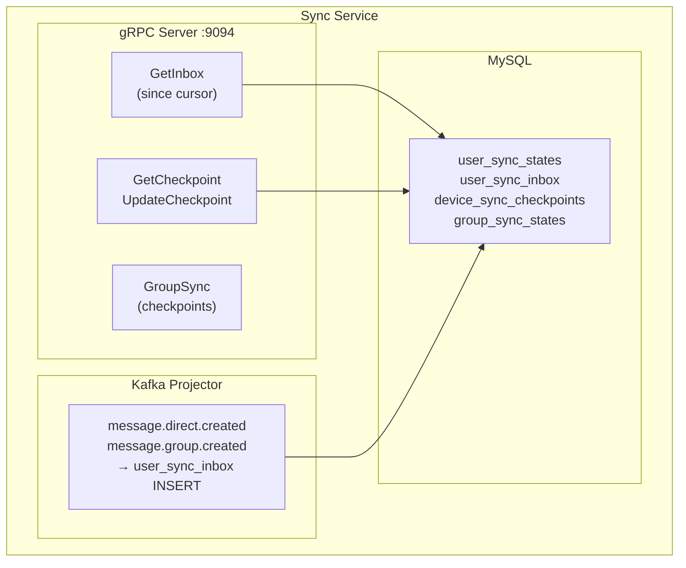
```mermaid
graph TB
    subgraph "Sync Service"
        subgraph "gRPC Server :9094"
            INBOX["GetInbox<br/>(since cursor)"]
            CHECKPOINT["GetCheckpoint<br/>UpdateCheckpoint"]
            GROUP_SYNC["GroupSync<br/>(checkpoints)"]
        end

        subgraph "Kafka Projector"
            PROJ["message.direct.created<br/>message.group.created<br/>→ user_sync_inbox INSERT"]
        end

        subgraph "MySQL"
            SYNC_DB["user_sync_states<br/>user_sync_inbox<br/>device_sync_checkpoints<br/>group_sync_states"]
        end
    end

    INBOX --> SYNC_DB
    CHECKPOINT --> SYNC_DB
    PROJ --> SYNC_DB
```

**同步模型：** 每条消息事件被投影为一条 `user_sync_inbox` 记录（AUTO_INCREMENT `sync_seq`）。客户端拉取时传递上次的 `sync_seq`，获取之后的所有增量。设备级游标确保多端同步独立性。

### 2.5 Search & Search Indexer

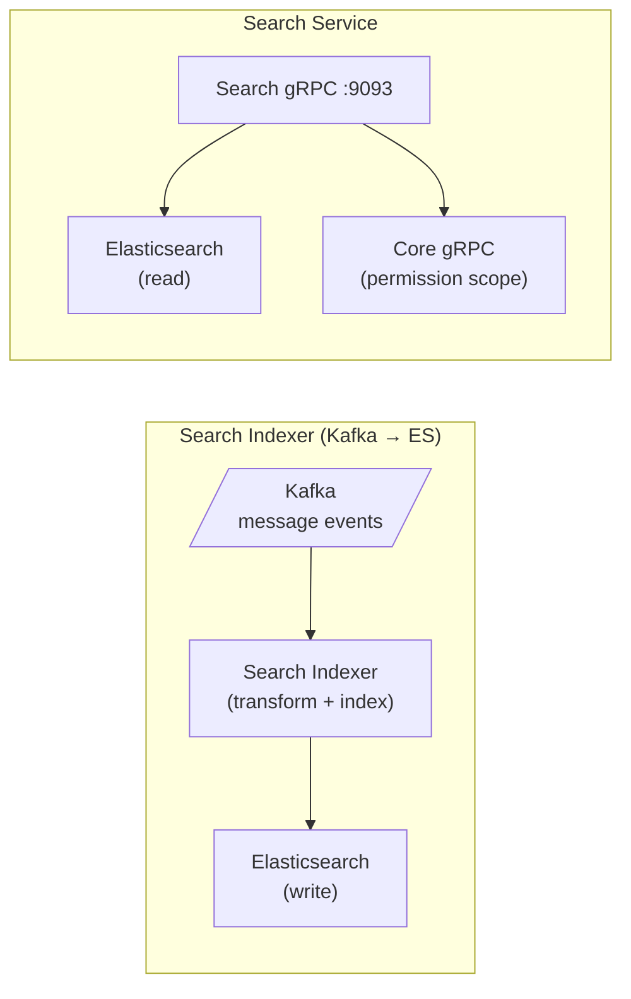
```mermaid
graph LR
    subgraph "Search Indexer (Kafka → ES)"
        KAFKA_IN[/"Kafka<br/>message events"/]
        INDEXER["Search Indexer<br/>(transform + index)"]
        ES_WRITE["Elasticsearch<br/>(write)"]
    end

    subgraph "Search Service"
        SEARCH_SVC["Search gRPC :9093"]
        ES_READ["Elasticsearch<br/>(read)"]
        CORE_SCOPE["Core gRPC<br/>(permission scope)"]
    end

    KAFKA_IN --> INDEXER --> ES_WRITE
    SEARCH_SVC --> ES_READ
    SEARCH_SVC --> CORE_SCOPE
```

**Search 是无状态读取器**，只调用 ES + Core 权限作用域。**Search Indexer 是 Kafka 消费者**，将消息事件变换为搜索文档并写入 ES。

### 2.6 Agent Runtime (TypeScript)

**入口：** `services/agent-runtime/src/index.ts`

**职责：** Agent 任务编排——Kafka 事件消费、Temporal 工作流、LLM 调用、MCP 工具系统

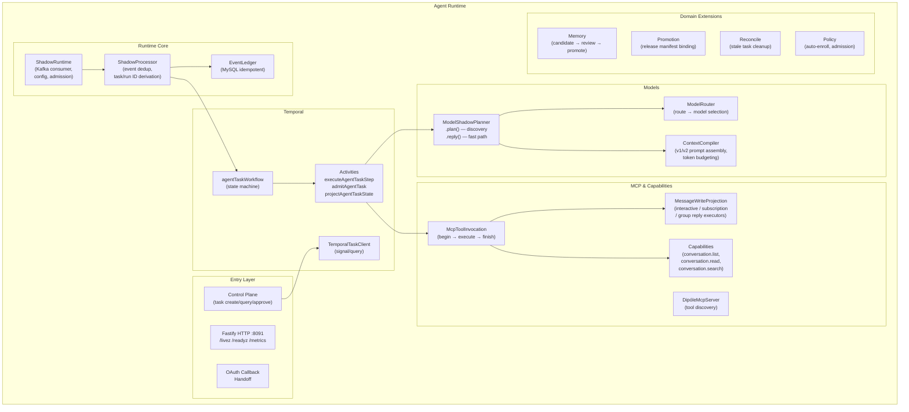
```mermaid
graph TB
    subgraph "Agent Runtime"
        subgraph "Entry Layer"
            HTTP["Fastify HTTP :8091<br/>/livez /readyz /metrics"]
            CTRL["Control Plane<br/>(task create/query/approve)"]
            OAUTH["OAuth Callback<br/>Handoff"]
        end

        subgraph "Runtime Core"
            SHADOW["ShadowRuntime<br/>(Kafka consumer,<br/>config, admission)"]
            PROCESSOR["ShadowProcessor<br/>(event dedup,<br/>task/run ID derivation)"]
            LEDGER["EventLedger<br/>(MySQL idempotent)"]
        end

        subgraph "Models"
            PLANNER["ModelShadowPlanner<br/>.plan() — discovery<br/>.reply() — fast path"]
            ROUTER["ModelRouter<br/>(route → model selection)"]
            CONTEXT["ContextCompiler<br/>(v1/v2 prompt assembly,<br/>token budgeting)"]
        end

        subgraph "Temporal"
            WORKFLOW["agentTaskWorkflow<br/>(state machine)"]
            ACTIVITIES["Activities<br/>executeAgentTaskStep<br/>admitAgentTask<br/>projectAgentTaskState"]
            TASK_CLIENT["TemporalTaskClient<br/>(signal/query)"]
        end

        subgraph "MCP & Capabilities"
            MCP_SERVER["DipóleMcpServer<br/>(tool discovery)"]
            INVOCATION["McpToolInvocation<br/>(begin → execute → finish)"]
            MSG_WRITE["MessageWriteProjection<br/>(interactive / subscription<br/>/ group reply executors)"]
            CAPS["Capabilities<br/>(conversation.list,<br/>conversation.read,<br/>conversation.search)"]
        end

        subgraph "Domain Extensions"
            MEMORY["Memory<br/>(candidate → review → promote)"]
            PROMO["Promotion<br/>(release manifest binding)"]
            RECONCILE["Reconcile<br/>(stale task cleanup)"]
            POLICY["Policy<br/>(auto-enroll, admission)"]
        end
    end

    SHADOW --> PROCESSOR --> LEDGER
    PROCESSOR --> WORKFLOW
    WORKFLOW --> ACTIVITIES
    ACTIVITIES --> PLANNER
    PLANNER --> ROUTER
    PLANNER --> CONTEXT
    ACTIVITIES --> INVOCATION
    INVOCATION --> MSG_WRITE
    INVOCATION --> CAPS
    CTRL --> TASK_CLIENT
```

**Temporal 工作流状态机：**

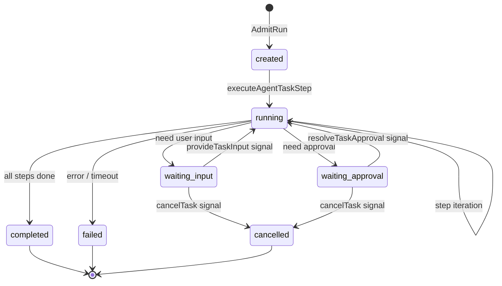
```mermaid
stateDiagram-v2
    [*] --> created: AdmitRun
    created --> running: executeAgentTaskStep
    running --> running: step iteration
    running --> waiting_input: need user input
    running --> waiting_approval: need approval
    waiting_input --> running: provideTaskInput signal
    waiting_approval --> running: resolveTaskApproval signal
    running --> completed: all steps done
    running --> failed: error / timeout
    waiting_input --> cancelled: cancelTask signal
    waiting_approval --> cancelled: cancelTask signal
    completed --> [*]
    failed --> [*]
    cancelled --> [*]
```

**Agent Runtime 内部模块详解：**

| 模块 | 路径 | 职责 |
|------|------|------|
| **runtime/** | `runtime/shadow-runtime.ts` | Kafka 消费者生命周期、配置加载、准入配线 |
| **events/** | `events/shadow-processor.ts` | 事件去重、task/run ID 确定性派生、plan 执行分发 |
| **events/** | `events/mysql-event-ledger.ts` | MySQL 幂等事件账本 |
| **models/** | `models/model-shadow-planner.ts` | LLM 调用：`plan()` 发现模式（3 次调用）、`reply()` 快速回复模式（1 次调用） |
| **models/** | `models/model-router.ts` | 按路由选择模型（DeepSeek v4-flash 等） |
| **context/** | `context/` | v1/v2 上下文装配、Token 预算管理 |
| **mcp/** | `mcp/dipole-mcp-server.ts` | MCP 工具发现与注册 |
| **mcp/** | `mcp/mcp-tool-invocation.ts` | 工具调用生命周期（begin → execute → finish → audit） |
| **mcp/** | `mcp/mcp-message-write-projection.ts` | 消息写入执行器（interactive reply / group reply / subscription reply） |
| **temporal/** | `temporal/agent-task-workflow.ts` | Temporal 工作流定义 |
| **temporal/** | `temporal/agent-task-read-activities.ts` | Temporal 活动实现（含 `inboundReplyIntent` 快速路径） |
| **capabilities/** | `capabilities/` | 能力封装：conversation list/read/search RPC 包装器 |
| **control/** | `control/` | HTTP 控制面 API |
| **task/** | `task/interactive-task-request.ts` | 显式任务创建 |
| **memory/** | `memory/` | 记忆候选管理 |
| **promotion/** | `promotion/agent-release-manifest.js` | 活跃运行时版本绑定 |
| **policy/** | `policy/` | 自动注册、准入策略 |
| **observability/** | `observability/` | 指标、日志 |

---

## 3. 前端架构

### 3.1 技术栈

- **框架：** Vue 3 (Composition API)
- **构建：** Vite + Rolldown
- **状态管理：** Pinia
- **UI 组件：** TDesign + PrimeVue
- **部署：** `go:embed` 嵌入 Core 二进制

### 3.2 模块结构

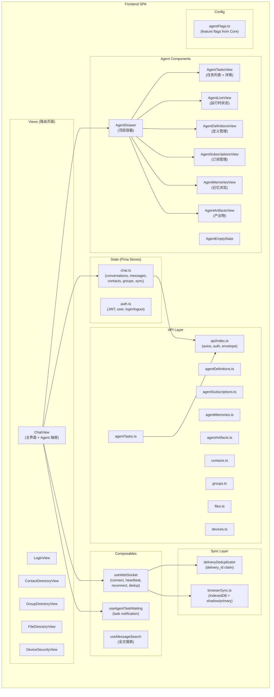
```mermaid
graph TB
    subgraph "Frontend SPA"
        subgraph "Views (路由页面)"
            LOGIN["LoginView"]
            CHAT["ChatView<br/>(主界面 + Agent 抽屉)"]
            CONTACTS["ContactDirectoryView"]
            GROUPS["GroupDirectoryView"]
            FILES["FileDirectoryView"]
            DEVICES["DeviceSecurityView"]
        end

        subgraph "Agent Components"
            DRAWER["AgentDrawer<br/>(顶层容器)"]
            TASKS["AgentTasksView<br/>(任务列表 + 详情)"]
            LIVE["AgentLiveView<br/>(运行时状态)"]
            DEFS["AgentDefinitionsView<br/>(定义管理)"]
            SUBS["AgentSubscriptionsView<br/>(订阅管理)"]
            MEMORIES["AgentMemoriesView<br/>(记忆浏览)"]
            ARTIFACTS["AgentArtifactsView<br/>(产出物)"]
            EMPTY["AgentEmptyState"]
        end

        subgraph "State (Pinia Stores)"
            S_AUTH["auth.ts<br/>(JWT, user, login/logout)"]
            S_CHAT["chat.ts<br/>(conversations, messages,<br/>contacts, groups, sync)"]
        end

        subgraph "Composables"
            C_WS["useWebSocket<br/>(connect, heartbeat,<br/>reconnect, dedup)"]
            C_TASK["useAgentTaskWaiting<br/>(task notification)"]
            C_SEARCH["useMessageSearch<br/>(全文搜索)"]
        end

        subgraph "API Layer"
            API_BASE["api/index.ts<br/>(axios, auth, envelope)"]
            API_TASKS["agentTasks.ts"]
            API_DEFS["agentDefinitions.ts"]
            API_SUBS["agentSubscriptions.ts"]
            API_MEM["agentMemories.ts"]
            API_ART["agentArtifacts.ts"]
            API_CONTACTS["contacts.ts"]
            API_GROUPS["groups.ts"]
            API_FILES["files.ts"]
            API_DEVICES["devices.ts"]
        end

        subgraph "Sync Layer"
            BROWSER_SYNC["browserSync.ts<br/>(IndexedDB + shadow/primary)"]
            DELIVERY_DEDUP["deliveryDeduplicator<br/>(delivery_id claim)"]
        end

        subgraph "Config"
            FLAGS["agentFlags.ts<br/>(feature flags from Core)"]
        end
    end

    CHAT --> DRAWER
    DRAWER --> TASKS
    DRAWER --> LIVE
    DRAWER --> DEFS
    DRAWER --> SUBS
    DRAWER --> MEMORIES
    DRAWER --> ARTIFACTS

    CHAT --> S_CHAT
    CHAT --> C_WS
    CHAT --> C_TASK

    S_CHAT --> API_BASE
    API_TASKS --> API_BASE
    C_WS --> DELIVERY_DEDUP
    C_WS --> BROWSER_SYNC
```

### 3.3 WebSocket 通信

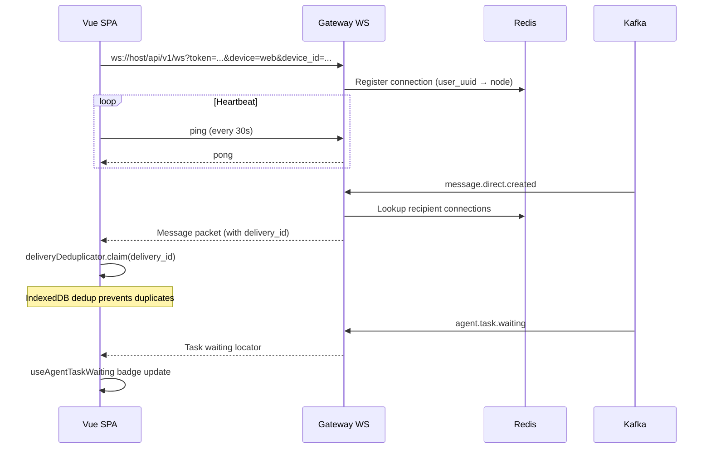
```mermaid
sequenceDiagram
    participant Client as Vue SPA
    participant GW as Gateway WS
    participant Redis
    participant Kafka

    Client->>GW: ws://host/api/v1/ws?token=...&device=web&device_id=...
    GW->>Redis: Register connection (user_uuid → node)

    loop Heartbeat
        Client->>GW: ping (every 30s)
        GW-->>Client: pong
    end

    Kafka->>GW: message.direct.created
    GW->>Redis: Lookup recipient connections
    GW-->>Client: Message packet (with delivery_id)
    Client->>Client: deliveryDeduplicator.claim(delivery_id)
    Note over Client: IndexedDB dedup prevents duplicates

    Kafka->>GW: agent.task.waiting
    GW-->>Client: Task waiting locator
    Client->>Client: useAgentTaskWaiting badge update
```

---

## 4. 数据模型

### 4.1 核心 IM 表

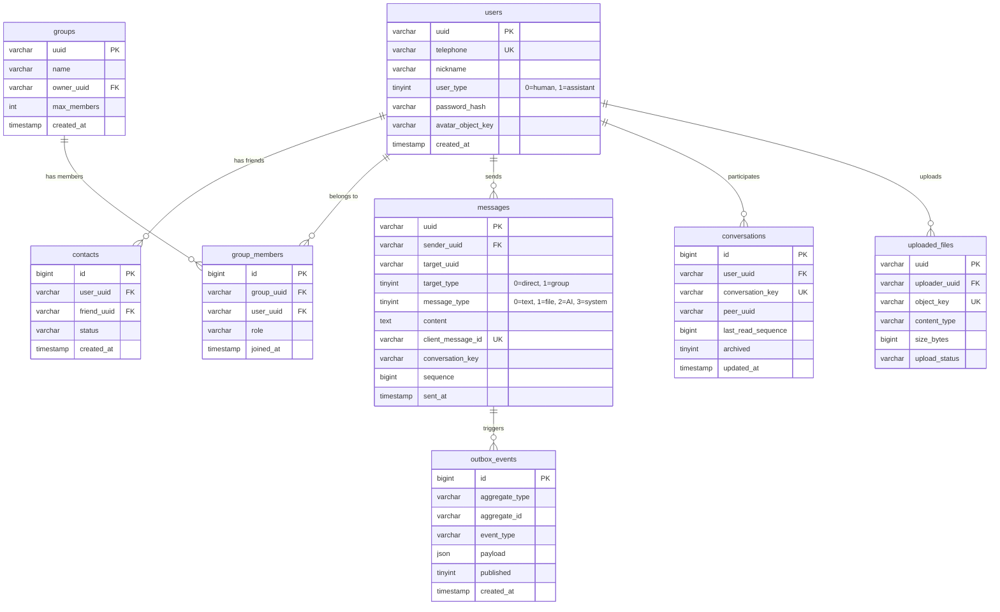
```mermaid
erDiagram
    users {
        varchar uuid PK
        varchar telephone UK
        varchar nickname
        tinyint user_type "0=human, 1=assistant"
        varchar password_hash
        varchar avatar_object_key
        timestamp created_at
    }

    contacts {
        bigint id PK
        varchar user_uuid FK
        varchar friend_uuid FK
        varchar status
        timestamp created_at
    }

    groups {
        varchar uuid PK
        varchar name
        varchar owner_uuid FK
        int max_members
        timestamp created_at
    }

    group_members {
        bigint id PK
        varchar group_uuid FK
        varchar user_uuid FK
        varchar role
        timestamp joined_at
    }

    messages {
        varchar uuid PK
        varchar sender_uuid FK
        varchar target_uuid
        tinyint target_type "0=direct, 1=group"
        tinyint message_type "0=text, 1=file, 2=AI, 3=system"
        text content
        varchar client_message_id UK
        varchar conversation_key
        bigint sequence
        timestamp sent_at
    }

    conversations {
        bigint id PK
        varchar user_uuid FK
        varchar conversation_key UK
        varchar peer_uuid
        bigint last_read_sequence
        tinyint archived
        timestamp updated_at
    }

    uploaded_files {
        varchar uuid PK
        varchar uploader_uuid FK
        varchar object_key UK
        varchar content_type
        bigint size_bytes
        varchar upload_status
    }

    outbox_events {
        bigint id PK
        varchar aggregate_type
        varchar aggregate_id
        varchar event_type
        json payload
        tinyint published
        timestamp created_at
    }

    users ||--o{ contacts : "has friends"
    users ||--o{ group_members : "belongs to"
    groups ||--o{ group_members : "has members"
    users ||--o{ messages : "sends"
    users ||--o{ conversations : "participates"
    users ||--o{ uploaded_files : "uploads"
    messages ||--o{ outbox_events : "triggers"
```

### 4.2 Sync 表

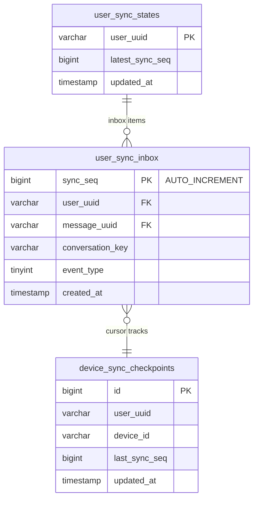
```mermaid
erDiagram
    user_sync_states {
        varchar user_uuid PK
        bigint latest_sync_seq
        timestamp updated_at
    }

    user_sync_inbox {
        bigint sync_seq PK "AUTO_INCREMENT"
        varchar user_uuid FK
        varchar message_uuid FK
        varchar conversation_key
        tinyint event_type
        timestamp created_at
    }

    device_sync_checkpoints {
        bigint id PK
        varchar user_uuid
        varchar device_id
        bigint last_sync_seq
        timestamp updated_at
    }

    user_sync_states ||--o{ user_sync_inbox : "inbox items"
    user_sync_inbox }o--|| device_sync_checkpoints : "cursor tracks"
```

### 4.3 Agent 领域表

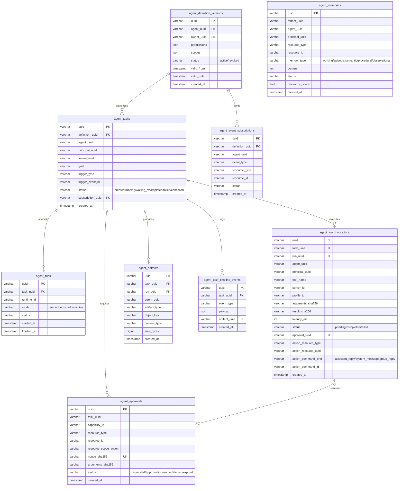
```mermaid
erDiagram
    agent_definition_versions {
        varchar uuid PK
        varchar agent_uuid FK
        varchar owner_uuid FK
        json permissions
        json scopes
        varchar status "active/revoked"
        timestamp valid_from
        timestamp valid_until
        timestamp created_at
    }

    agent_tasks {
        varchar uuid PK
        varchar definition_uuid FK
        varchar agent_uuid
        varchar principal_uuid
        varchar tenant_uuid
        varchar goal
        varchar trigger_type
        varchar trigger_event_id
        varchar status "created/running/waiting_*/completed/failed/cancelled"
        varchar subscription_uuid FK
        timestamp created_at
    }

    agent_runs {
        varchar uuid PK
        varchar task_uuid FK
        varchar runtime_id
        varchar mode "embedded/shadow/active"
        varchar status
        timestamp started_at
        timestamp finished_at
    }

    agent_approvals {
        varchar uuid PK
        varchar task_uuid
        varchar capability_id
        varchar resource_type
        varchar resource_id
        varchar resource_scope_action
        varchar nonce_sha256 UK
        varchar arguments_sha256
        varchar status "requested/approved/consumed/denied/expired"
        timestamp created_at
    }

    agent_tool_invocations {
        varchar uuid PK
        varchar task_uuid FK
        varchar run_uuid FK
        varchar agent_uuid
        varchar principal_uuid
        varchar tool_name
        varchar server_id
        varchar profile_id
        varchar arguments_sha256
        varchar result_sha256
        int latency_ms
        varchar status "pending/completed/failed"
        varchar approval_uuid FK
        varchar action_resource_type
        varchar action_resource_uuid
        varchar action_command_kind "assistant_reply/system_message/group_reply"
        varchar action_command_id
        timestamp created_at
    }

    agent_event_subscriptions {
        varchar uuid PK
        varchar definition_uuid FK
        varchar agent_uuid
        varchar event_type
        varchar resource_type
        varchar resource_id
        varchar status
        timestamp created_at
    }

    agent_memories {
        varchar uuid PK
        varchar tenant_uuid
        varchar agent_uuid
        varchar principal_uuid
        varchar resource_type
        varchar resource_id
        varchar memory_type "working/episodic/semantic/procedural/observational"
        text content
        varchar status
        float relevance_score
        timestamp created_at
    }

    agent_artifacts {
        varchar uuid PK
        varchar task_uuid FK
        varchar run_uuid FK
        varchar agent_uuid
        varchar artifact_type
        varchar object_key
        varchar content_type
        bigint size_bytes
        timestamp created_at
    }

    agent_task_timeline_events {
        varchar uuid PK
        varchar task_uuid FK
        varchar event_type
        json payload
        varchar artifact_uuid FK
        timestamp created_at
    }

    agent_definition_versions ||--o{ agent_tasks : "authorizes"
    agent_definition_versions ||--o{ agent_event_subscriptions : "binds"
    agent_tasks ||--o{ agent_runs : "attempts"
    agent_tasks ||--o{ agent_approvals : "requires"
    agent_tasks ||--o{ agent_tool_invocations : "executes"
    agent_tasks ||--o{ agent_artifacts : "produces"
    agent_tasks ||--o{ agent_task_timeline_events : "logs"
    agent_tool_invocations }o--o| agent_approvals : "consumes"
```

**其他 Agent 辅助表：**

| 表 | 用途 |
|----|------|
| `agent_event_ledger` | 事件幂等去重 |
| `agent_shadow_plans`, `agent_shadow_steps` | 影子轨迹 + step 租约 |
| `agent_model_runs`, `agent_model_calls` | LLM 调用审计 |
| `agent_context_manifest` | 上下文装配审计 |
| `agent_mcp_tool_rounds`, `agent_mcp_tool_commands` | MCP 轮次审计 |
| `agent_memory_candidates`, `agent_memory_reviews`, `agent_memory_promotions` | 记忆治理管线 |
| `agent_memory_lineage`, `agent_memory_corrections`, `agent_memory_erasure_reviews` | 记忆血缘与纠正 |
| `agent_task_workflow_projection` | Temporal → MySQL 状态镜像 |
| `agent_runtime_promotion_*` | 运行时版本晋升治理 |
| `agent_workflow_repair_*` | 工作流修复治理 |
| `agent_oauth_*` | OAuth/MCP 外部服务认证 |
| `agent_context_ablation_bindings` | 上下文消融实验 |

---

## 5. 核心数据流

### 5.1 消息发送与投递

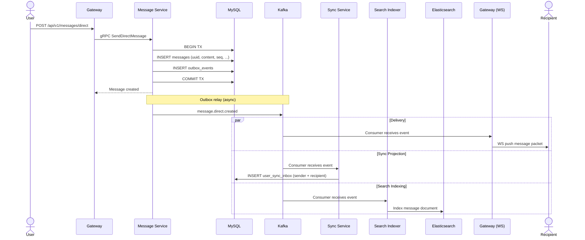
```mermaid
sequenceDiagram
    actor User
    participant GW as Gateway
    participant MSG as Message Service
    participant MySQL as MySQL
    participant Kafka
    participant SYNC as Sync Service
    participant SIDX as Search Indexer
    participant ES as Elasticsearch
    participant GW2 as Gateway (WS)
    actor Recipient

    User->>GW: POST /api/v1/messages/direct
    GW->>MSG: gRPC SendDirectMessage
    MSG->>MySQL: BEGIN TX
    MSG->>MySQL: INSERT messages (uuid, content, seq, ...)
    MSG->>MySQL: INSERT outbox_events
    MSG->>MySQL: COMMIT TX
    MSG-->>GW: Message created

    Note over MSG,Kafka: Outbox relay (async)
    MSG->>Kafka: message.direct.created

    par Delivery
        Kafka->>GW2: Consumer receives event
        GW2->>Recipient: WS push message packet
    and Sync Projection
        Kafka->>SYNC: Consumer receives event
        SYNC->>MySQL: INSERT user_sync_inbox (sender + recipient)
    and Search Indexing
        Kafka->>SIDX: Consumer receives event
        SIDX->>ES: Index message document
    end
```

### 5.2 Agent Task 生命周期（入站 DM，Route B1）

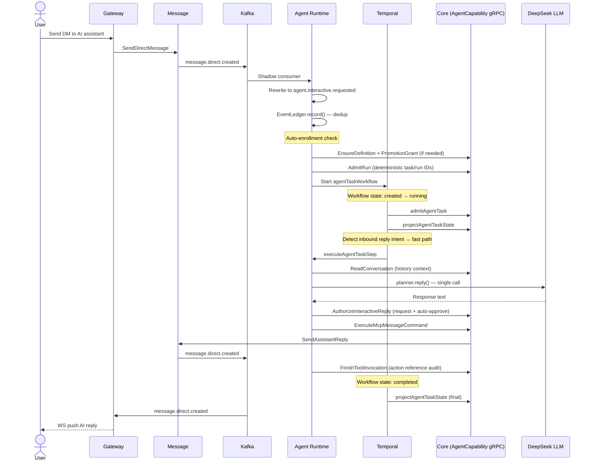
```mermaid
sequenceDiagram
    actor User
    participant GW as Gateway
    participant MSG as Message
    participant Kafka
    participant ART as Agent Runtime
    participant TEMP as Temporal
    participant CORE as Core (AgentCapability gRPC)
    participant LLM as DeepSeek LLM

    User->>GW: Send DM to AI assistant
    GW->>MSG: SendDirectMessage
    MSG->>Kafka: message.direct.created

    Kafka->>ART: Shadow consumer
    ART->>ART: Rewrite to agent.interactive.requested
    ART->>ART: EventLedger.record() — dedup

    Note over ART: Auto-enrollment check
    ART->>CORE: EnsureDefinition + PromotionGrant (if needed)

    ART->>CORE: AdmitRun (deterministic task/run IDs)
    ART->>TEMP: Start agentTaskWorkflow

    Note over TEMP: Workflow state: created → running
    TEMP->>CORE: admitAgentTask
    TEMP->>CORE: projectAgentTaskState

    Note over TEMP: Detect inbound reply intent → fast path
    TEMP->>ART: executeAgentTaskStep

    ART->>CORE: ReadConversation (history context)
    ART->>LLM: planner.reply() — single call
    LLM-->>ART: Response text

    ART->>CORE: AuthorizeInteractiveReply (request + auto-approve)
    ART->>CORE: ExecuteMcpMessageCommand
    CORE->>MSG: SendAssistantReply
    MSG->>Kafka: message.direct.created

    ART->>CORE: FinishToolInvocation (action reference audit)

    Note over TEMP: Workflow state: completed
    TEMP->>CORE: projectAgentTaskState (final)

    Kafka->>GW: message.direct.created
    GW-->>User: WS push AI reply
```

### 5.3 Agent 群组 @回复（Route B2）

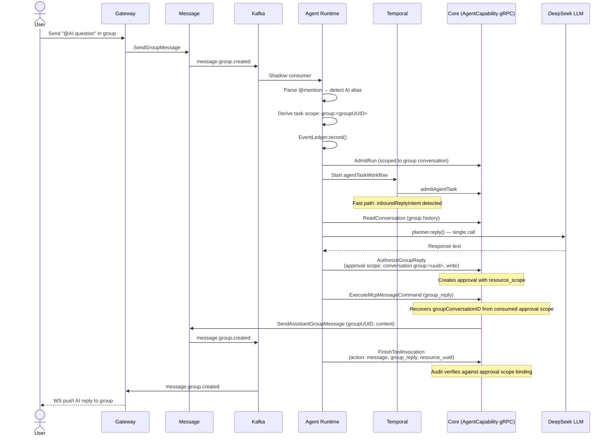
```mermaid
sequenceDiagram
    actor User
    participant GW as Gateway
    participant MSG as Message
    participant Kafka
    participant ART as Agent Runtime
    participant TEMP as Temporal
    participant CORE as Core (AgentCapability gRPC)
    participant LLM as DeepSeek LLM

    User->>GW: Send "@AI question" in group
    GW->>MSG: SendGroupMessage
    MSG->>Kafka: message.group.created

    Kafka->>ART: Shadow consumer
    ART->>ART: Parse @mention → detect AI alias
    ART->>ART: Derive task scope: group:<groupUUID>
    ART->>ART: EventLedger.record()

    ART->>CORE: AdmitRun (scoped to group conversation)
    ART->>TEMP: Start agentTaskWorkflow

    TEMP->>CORE: admitAgentTask
    Note over TEMP: Fast path: inboundReplyIntent detected

    ART->>CORE: ReadConversation (group history)
    ART->>LLM: planner.reply() — single call
    LLM-->>ART: Response text

    ART->>CORE: AuthorizeGroupReply<br/>(approval scope: conversation group:<uuid>, write)
    Note over CORE: Creates approval with resource_scope

    ART->>CORE: ExecuteMcpMessageCommand (group_reply)
    Note over CORE: Recovers groupConversationID from consumed approval scope
    CORE->>MSG: SendAssistantGroupMessage (groupUUID, content)
    MSG->>Kafka: message.group.created

    ART->>CORE: FinishToolInvocation<br/>(action: message, group_reply, resource_uuid)
    Note over CORE: Audit verifies against approval scope binding

    Kafka->>GW: message.group.created
    GW-->>User: WS push AI reply to group
```

---

## 6. 部署架构

### 6.1 Compose 叠加模型

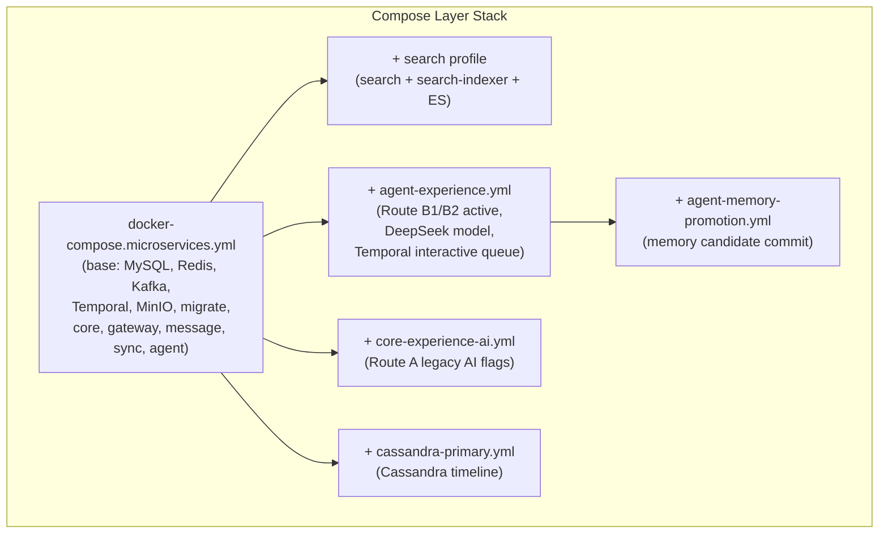
```mermaid
graph TD
    subgraph "Compose Layer Stack"
        BASE["docker-compose.microservices.yml<br/>(base: MySQL, Redis, Kafka,<br/>Temporal, MinIO, migrate,<br/>core, gateway, message, sync, agent)"]

        SEARCH_PROFILE["+ search profile<br/>(search + search-indexer + ES)"]

        EXP["+ agent-experience.yml<br/>(Route B1/B2 active,<br/>DeepSeek model,<br/>Temporal interactive queue)"]

        CORE_AI["+ core-experience-ai.yml<br/>(Route A legacy AI flags)"]

        MEMORY["+ agent-memory-promotion.yml<br/>(memory candidate commit)"]

        CASS["+ cassandra-primary.yml<br/>(Cassandra timeline)"]
    end

    BASE --> SEARCH_PROFILE
    BASE --> EXP
    BASE --> CORE_AI
    EXP --> MEMORY
    BASE --> CASS
```

### 6.2 生产级拓扑

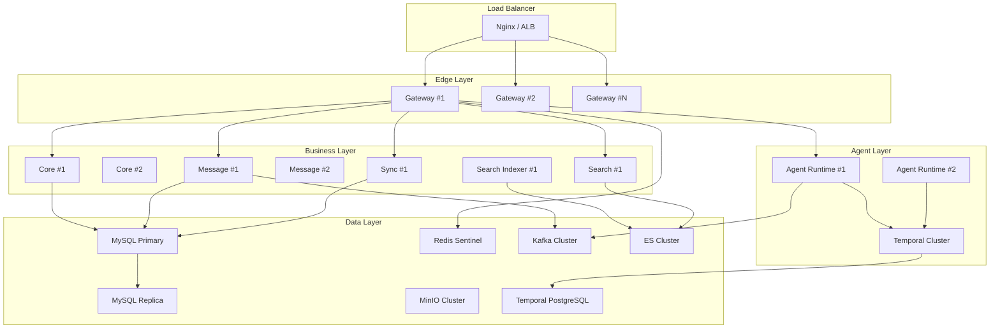
```mermaid
graph TB
    subgraph "Load Balancer"
        LB["Nginx / ALB"]
    end

    subgraph "Edge Layer"
        GW1["Gateway #1"]
        GW2["Gateway #2"]
        GWN["Gateway #N"]
    end

    subgraph "Business Layer"
        CORE1["Core #1"]
        CORE2["Core #2"]
        MSG1["Message #1"]
        MSG2["Message #2"]
        SYNC1["Sync #1"]
        SEARCH1["Search #1"]
        SIDX1["Search Indexer #1"]
    end

    subgraph "Agent Layer"
        ART1["Agent Runtime #1"]
        ART2["Agent Runtime #2"]
        TEMP["Temporal Cluster"]
    end

    subgraph "Data Layer"
        MYSQL_PRI["MySQL Primary"]
        MYSQL_REP["MySQL Replica"]
        REDIS_SENT["Redis Sentinel"]
        KAFKA_CL["Kafka Cluster"]
        MINIO_CL["MinIO Cluster"]
        ES_CL["ES Cluster"]
        PG["Temporal PostgreSQL"]
    end

    LB --> GW1
    LB --> GW2
    LB --> GWN

    GW1 --> CORE1
    GW1 --> MSG1
    GW1 --> SYNC1
    GW1 --> SEARCH1
    GW1 --> ART1

    ART1 --> TEMP
    ART2 --> TEMP
    TEMP --> PG

    CORE1 --> MYSQL_PRI
    MSG1 --> MYSQL_PRI
    SYNC1 --> MYSQL_PRI
    MYSQL_PRI --> MYSQL_REP

    GW1 --> REDIS_SENT
    ART1 --> KAFKA_CL
    MSG1 --> KAFKA_CL
    SIDX1 --> ES_CL
    SEARCH1 --> ES_CL
```

### 6.3 镜像构建

| 镜像 | Dockerfile | 构建参数 | 运行时 |
|------|-----------|---------|--------|
| `dipole-core` | `deploy/images/go-service.Dockerfile` | `DIPOLE_BINARY=dipole-core` | Alpine + Go binary + embedded webapp |
| `dipole-gateway` | 同上 | `DIPOLE_BINARY=dipole-gateway` | Alpine + Go binary |
| `dipole-message` | 同上 | `DIPOLE_BINARY=dipole-message` | Alpine + Go binary |
| `dipole-sync` | 同上 | `DIPOLE_BINARY=dipole-sync` | Alpine + Go binary |
| `dipole-search` | 同上 | `DIPOLE_BINARY=dipole-search` | Alpine + Go binary |
| `dipole-search-indexer` | 同上 | `DIPOLE_BINARY=dipole-search-indexer` | Alpine + Go binary |
| `dipole-migrate` | 同上 | `DIPOLE_BINARY=dipole-migrate` | Alpine + Go binary |
| `dipole-agent` | `services/agent-runtime/Dockerfile` | — | Node.js 20 + compiled TS |

### 6.4 关键环境变量

| 变量前缀 | 作用域 | 示例 |
|----------|--------|------|
| `DIPOLE_DB_*` | 数据库连接 | `DIPOLE_DB_HOST`, `DIPOLE_DB_NAME` |
| `DIPOLE_REDIS_*` | Redis 连接 | `DIPOLE_REDIS_HOST` |
| `DIPOLE_KAFKA_*` | Kafka 连接 | `DIPOLE_KAFKA_BROKERS` |
| `DIPOLE_INTERNAL_RPC_*` | gRPC 服务发现 | `DIPOLE_INTERNAL_RPC_CORE_TARGET=core:9091` |
| `DIPOLE_GATEWAY_*` | Gateway 模式 | `DIPOLE_GATEWAY_MODE=remote` |
| `DIPOLE_AI_*` | Legacy AI 开关 | `DIPOLE_AI_DIRECT_REPLY_ENABLED=false` |
| `DIPOLE_AGENT_*` | Agent Runtime 配置 | `DIPOLE_AGENT_INBOUND_DM_ENABLED=true` |
| `DIPOLE_AGENT_MODEL_*` | LLM 配置 | `DIPOLE_AGENT_MODEL_PROVIDER=deepseek` |
| `DIPOLE_FRONTEND_*` | 前端 Feature Flag | `DIPOLE_FRONTEND_AGENT_TASKS_ENABLED=true` |

### 6.5 嵌入式模式回退

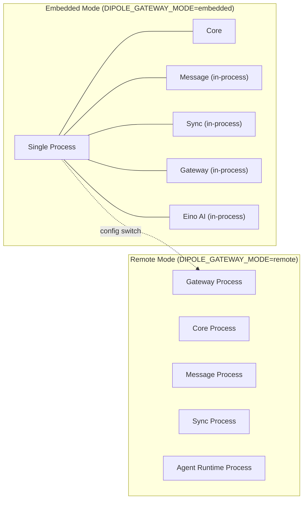
```mermaid
graph LR
    subgraph "Embedded Mode (DIPOLE_GATEWAY_MODE=embedded)"
        SINGLE["Single Process"]
        SINGLE --- CORE_E["Core"]
        SINGLE --- MSG_E["Message (in-process)"]
        SINGLE --- SYNC_E["Sync (in-process)"]
        SINGLE --- GW_E["Gateway (in-process)"]
        SINGLE --- AI_E["Eino AI (in-process)"]
    end

    subgraph "Remote Mode (DIPOLE_GATEWAY_MODE=remote)"
        GW_R["Gateway Process"]
        CORE_R["Core Process"]
        MSG_R["Message Process"]
        SYNC_R["Sync Process"]
        ART_R["Agent Runtime Process"]
    end

    SINGLE -.->|"config switch"| GW_R
```

---

## 7. gRPC 契约总览

### 7.1 Proto 服务注册

```
api/proto/
├── dipole/
│   ├── agent/v1/agent.proto       # AgentCapabilityService (70+ RPCs)
│   ├── common/v1/context.proto    # 共享上下文类型
│   ├── core/v1/core.proto         # CoreCapabilityService
│   ├── delivery/v1/delivery.proto # NodeDeliveryService (realtime)
│   ├── message/v1/message.proto   # MessageService
│   ├── search/v1/search.proto     # SearchService
│   └── sync/v1/sync.proto         # SyncQueryService
```

### 7.2 服务间 RPC 调用图

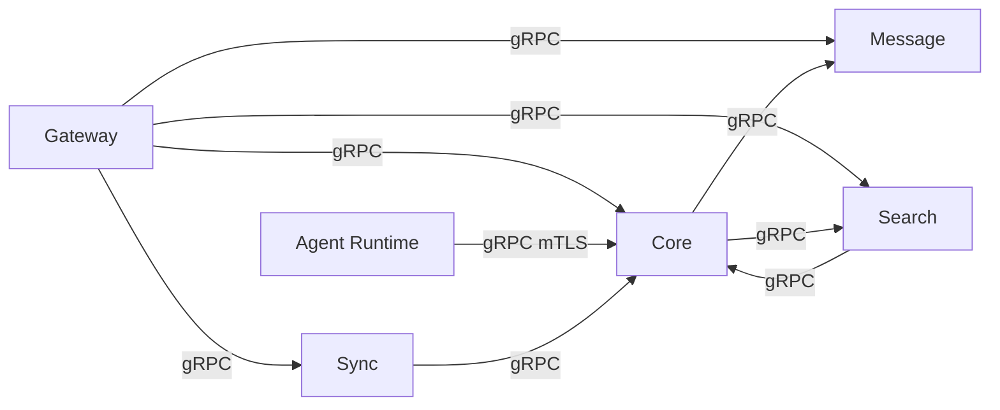
```mermaid
graph LR
    GW["Gateway"] -->|gRPC| CORE["Core"]
    GW -->|gRPC| MSG["Message"]
    GW -->|gRPC| SYNC["Sync"]
    GW -->|gRPC| SEARCH["Search"]

    ART["Agent Runtime"] -->|gRPC mTLS| CORE

    CORE -->|gRPC| MSG
    CORE -->|gRPC| SEARCH

    SYNC -->|gRPC| CORE

    SEARCH -->|gRPC| CORE
```

---

## 8. Kafka 事件拓扑

### 8.1 Topic 与消费者

```mermaid
graph LR
    subgraph "Producers"
        MSG_P["Message Service"]
        CORE_P["Core Service"]
    end

    subgraph "Topics"
        T1["message.direct.created"]
        T2["message.group.created"]
        T3["agent.task.waiting"]
        T4["contact.*.created"]
        T5["group.*.created"]
        T6["session.*.created"]
    end

    subgraph "Consumers"
        GW_C["Gateway<br/>(WS delivery)"]
        SYNC_C["Sync<br/>(inbox projection)"]
        SIDX_C["Search Indexer<br/>(ES indexing)"]
        ART_C["Agent Runtime<br/>(inbound trigger)"]
        CORE_C["Core<br/>(conversation projection,<br/>legacy AI handlers)"]
    end

    MSG_P --> T1
    MSG_P --> T2
    CORE_P --> T3
    CORE_P --> T4
    CORE_P --> T5
    CORE_P --> T6

    T1 --> GW_C
    T1 --> SYNC_C
    T1 --> SIDX_C
    T1 --> ART_C
    T1 --> CORE_C

    T2 --> GW_C
    T2 --> SYNC_C
    T2 --> SIDX_C
    T2 --> ART_C
    T2 --> CORE_C

    T3 --> GW_C
```

### 8.2 事件消费互斥

Route A (Legacy Go) 和 Route B (Governed TS) 对同一 Kafka 事件的消费是**互斥的**，通过环境变量控制：

| 触发类型 | Route A 开关 | Route B 开关 | 生产推荐 |
|----------|-------------|-------------|----------|
| DM → AI 回复 | `DIPOLE_AI_DIRECT_REPLY_ENABLED` | `DIPOLE_AGENT_INBOUND_DM_ENABLED` | B on, A off |
| Group @AI → 回复 | `DIPOLE_AI_GROUP_REPLY_ENABLED` | `DIPOLE_AGENT_INBOUND_GROUP_MENTION_ENABLED` | B on, A off |

⚠️ **两条路线不能同时开启**，否则用户会收到两份回复。
