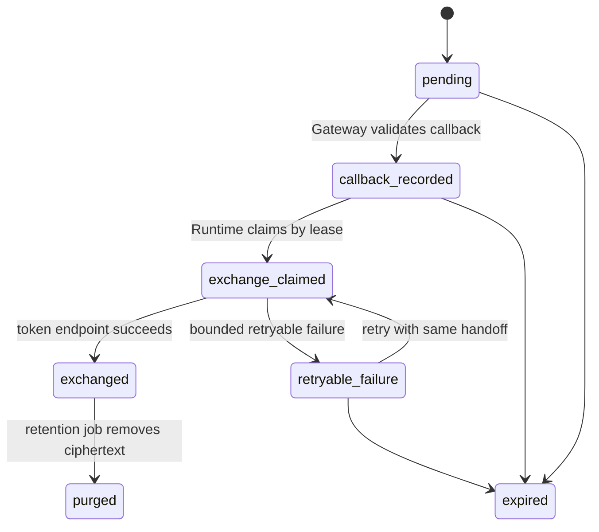

# Agent OAuth Callback Handoff

## Status

`foundation in progress; end-to-end route blocked`。当前已具备 discovery、PKCE、密封 verifier、SQLC transaction、Core consume RPC、`000053` durable handoff persistence、SQLC 原子记录仓储、默认关闭的 Core record RPC、Gateway record client、Runtime public-key envelope v1，以及受 `dipole-agent` mTLS caller 限制的 claim/complete/release RPC。Gateway 现只会在 `gateway.agent_oauth_callback_enabled=true` 时注册 `/oauth/callback`，并在启动时读取 Runtime public key、构造 Core record client、构造 Runtime handoff-ID notifier 与校验 handler；任何缺失材料都会阻止 Gateway 启动。Compose 默认传入空材料，且不挂载密钥文件，默认公开路由继续关闭。原子记录将 transaction 校验、handoff 写入与 transaction consume 收敛在同一 MySQL transaction，并支持精确 callback 重放。record RPC 仅信任 `dipole-gateway`，owner 始终从可信 RequestContext 恢复。Core 仅在 `agent_oauth_callback_handoff_enabled=true` 与内部 RPC mTLS 同时成立时注入 handoff Store。Runtime HTTP control handler 仍未装配，因此这组 Gateway 配置不能独立构成可发布 callback。

### Provider exchange + token lifecycle（默认关闭）

2026-09-04 起，Runtime 侧补上了 provider exchange + token lifecycle 的**离线组合**闭环，仍**默认不装配**：`services/agent-runtime/src/index.ts` 与所有 bootstrap、Compose overlay、环境变量都没有引用；`OAuthCallbackRuntimeConfig` 依然默认 `enabled=false`，并且 `assertOAuthCallbackRuntimeUnavailable` 会在启用时明确抛错，直到有 approved provider 部署 profile。

- `OAuthCallbackProvider` 是唯一新增的接口：吃 executor 已经解开的 authorization code，只返回 `{ kind: "exchanged" | "retryable_failure" | "permanent_failure" }` 三种声明结果；不确定失败必须抛错以让 executor 保留 lease（沿用现有"outcome unknown 保留 lease"契约）。
- `DeterministicFakeOAuthCallbackProvider` 是测试双重：按 `sha256(authorizationCode)` 查 plan，`exchanged` / `permanent_failure` 幂等缓存，`retryable_failure` 每次都会真调，`throw` outcome 用来模拟不确定；无任何真实 HTTP。
- `TokenLifecycleStore`（进程内）承载离线 fixture 的 `pending_exchange → active → refreshed → { revoked | expired }` 状态机；terminal 后 `accessToken` / `refreshToken` 置 null 仅保留 metadata，非法转换 fail closed。生产路径现有 Core-owned `000060_agent_oauth_token_lifecycles` SQLC seam：`PersistOAuthTokenLifecycle` 仅接受 mTLS `dipole-agent`，将首次 opaque envelope 写入绑定到仍有效的 callback lease，并对精确重复提交幂等。Runtime 已有未装配的 token envelope v1 与 RPC client：provider 成功时先写入 `active`，永久失败时仅写入无密文的 `revoked`，两者均在 Core 确认后才更新本地 fixture 并允许 executor complete handoff；详见 [`agent-oauth-token-lifecycle/v1`](../../contracts/agent-oauth-token-lifecycle/v1/README.md)。refresh/revoke/retention worker 仍未装配，因此该 RPC 不构成可发布 token lifecycle。
- `OAuthCallbackHandoffProviderProcessor` 把 provider + lifecycle wire 成 executor 认识的 `OAuthCallbackHandoffProcessor`：`exchanged` 写 active → `"completed"`；`retryable_failure` 不写 lifecycle → `"retryable_failure"`；`permanent_failure` 写 revoked → `"completed"`；lifecycle 已有 active / refreshed / revoked 时短路返回 `"completed"`，用于精确重放保护（Core 本身也拒绝二次 claim，此为进程内的第二道去重）。
- 端到端 6 场景（重复 notify、Worker 重启换 lease owner、claim 后 lease 超时、`exchanged` 精确重放被 Core 拒、`retryable_failure` 回滚后再次 claim 成功、`PERMISSION_DENIED` 时 Runtime 不打开 envelope / 不调 provider / 不写 lifecycle）在 `services/agent-runtime/src/mcp/oauth-callback-handoff-durable-runtime.test.ts` 用离线 fake Core store + fake provider 覆盖。

隔离的 Core/MySQL restart drill 使用 `scripts/drill-agent-oauth-token-lifecycle-mysql-mtls-restart.sh`。它只启动一次性 MySQL，迁移独立 schema 后以 TLS 1.3 mTLS 启动 Core、持久化一次 active lifecycle、重启 Core listener 并重放相同请求，最后验证只存在一条记录且 metadata 改写被拒绝。脚本不注册 Gateway callback route，不启动 Runtime Provider、Kafka 或 Temporal，也不会触碰公共 Compose project。

回滚：关闭 Gateway route 开关或保持这组可选组件未装配即可；executor / claim / terminal / envelope / key source 未受修改，Runtime `index.ts`、Compose / env 和前端仍未接线。真实 provider adapter、Core-owned token lifecycle SQLC 表、Runtime 侧密钥轮换 / retention job、Runtime control handler 装配依然是 release 前置。

## Why The Gate Exists

当前 transaction consume 是单次条件更新。持久 handoff 已允许 Runtime 在 callback 后领取密文记录；不过 Runtime control handler 和 Provider profile 还未装配，因此当前 Gateway route 开关继续保持关闭。

此外，OAuth callback 只能携带 `code`、`state` 与可选 issuer 参数。Gateway 已具备签名的 correlation v1 原语，可绑定 transaction、owner、issuer、redirect URI、state 摘要、browser-session 摘要与 expiry。该原语已由默认关闭 handler 复核 issuer、redirect URI 与 browser binding；cookie 签发与 Runtime 端控制面仍是发布前置。

这项门禁遵循 [RFC 9700](https://www.rfc-editor.org/rfc/rfc9700.html) 的 redirect-flow 与 PKCE 要求：精确 redirect URI、事务唯一的 S256 PKCE、可验证的 state/浏览器绑定，以及对多 Authorization Server 的 mix-up 防护。

## Required Contract

授权发起方必须产生 Gateway 可验证的 callback correlation。它可采用 HttpOnly、Secure、SameSite=Lax 的短时 cookie，或 Gateway 签名且加密的 opaque envelope；无论采用哪一种，Gateway 都必须在 callback 前恢复以下受信字段：

```text
transaction_id
owner_user_id
issuer
redirect_uri
expires_at
browser_session_binding
```

`state` 保持随机、高熵、单次使用值。Gateway 只将其 SHA-256 提交给 Core；任何 query、日志、审计、Kafka event、Temporal history 和浏览器 JSON response 均不得保存原始 `state`、authorization code、PKCE verifier 或 token。

Core 必须在 transaction record 中精确核对：

```text
transaction_id + owner + state_sha256 + issuer + redirect_uri + expiry
```

当前 Core consume RPC 已覆盖其中一部分。callback correlation v1 已作为 additive contract 落地；后续 handler 必须使用它完成 issuer mix-up、redirect URI 与 browser binding 验证，且不得复用未经验证的浏览器 session 字段。

## Durable Handoff State Machine

可靠 handoff 使用独立记录，不能以 Kafka 或 Gateway 内存代替。`000053` 已实现 `callback_recorded`、`exchange_claimed`、`exchanged` 以及受 expiry 限制的 lease claim/complete/release；Core 将三项 transition 仅暴露给 `dipole-agent` mTLS caller，缺 Store 时返回 `Unavailable`。Gateway callback 仅在显式配置下装配，Runtime 默认仍未装配：



`callback_recorded` stores the authorization code only as a KMS/envelope-encrypted ciphertext for the Runtime key boundary, together with its SHA-256, transaction binding, expiry and idempotency key. Gateway cannot decrypt it. The code hash is unique per transaction; Runtime records token-exchange terminal state before exposing completion. A failed Runtime delivery therefore remains retryable without a second browser callback, while a duplicate callback cannot create a second exchange. The SQLC recording repository and its Core record RPC have Remote GPU MySQL coverage for first-write, exact-replay and unique-key rollback; their Compose gate remains disabled by default. Envelope v1 now fixes a hybrid RSA-OAEP-SHA256 + AES-256-GCM format and binding AAD in `contracts/agent-oauth-callback-handoff/v1`. An unmounted Runtime private-key file source validates key identity, ownership, permissions and RSA strength before a bounded use callback. Runtime key configuration/rotation, control handler and exchange seam remain release prerequisites.

## Boundaries

| Component | Allowed responsibility | Forbidden responsibility |
| --- | --- | --- |
| Gateway | callback correlation, state digest, Core claim, encrypted handoff write | verifier decryption, token exchange, token storage |
| Core | transaction ownership, conditional claim, durable handoff metadata | raw code logging, Runtime key access |
| Agent Runtime | KMS decrypt, token exchange, refresh/revoke lifecycle | browser callback authentication, plaintext persistence |
| Kafka / Temporal | low-sensitivity progress reference only | code, verifier, token or ciphertext payload |

The exact dual-channel transport and failure contract is maintained in
[`contracts/agent-oauth-callback-handoff/v1/TRANSPORT.md`](../../contracts/agent-oauth-callback-handoff/v1/TRANSPORT.md). It is a release prerequisite, not evidence that a callback route exists.

## Release Prerequisites

1. 已完成：将 versioned callback-correlation contract 装配为默认关闭的 Gateway handler，复核 expiry、issuer mix-up、redirect URI 与 browser binding。
2. 已完成：Agent-owned SQLC handoff table、Runtime-only envelope ciphertext、code-hash uniqueness 与 lease/terminal transitions。
3. 已完成：Gateway 和 Runtime mTLS clients，且控制面不记录 request body 或敏感 headers。
4. 部分完成：Core-owned SQLC persistence 已绑定 callback lease；仍需 Runtime-key token envelope、refresh/revoke/retention 的幂等 worker 与恢复演练。
5. 装配经评审的 Runtime provider profile 与 handoff receiver；启用后必须在 Runtime 启动时验证私钥、Core mTLS、provider 身份与 lifecycle backend。
6. Add fault tests for duplicate callback, Runtime unavailable after claim, restart during exchange, expired correlation, wrong issuer, wrong redirect URI and wrong browser binding.
7. 完成 provider owner 评审、受控端到端演练和回滚演练后，才允许同时启用 Gateway 与 Runtime。

## Current Safe Surface

默认部署保持零 OAuth callback surface：`gateway.agent_oauth_callback_enabled=false`，Runtime handoff receiver、token exchange、token persistence 和 active Runtime profile 均未装配。Gateway 已有受完整配置约束的 `/oauth/callback` route；单独打开它不能形成完整 profile，也不得用于共享环境。Runtime 包含未装配的 claim 和 terminal clients；其 mTLS-only claim 响应包含重建 envelope AAD 所需的 owner binding，`index.ts` 不会构造这些组件。executor 会在私钥使用前及 provider processor 前复核 durable handoff expiry/lease expiry；pre-effect 失败释放 lease，未知 processor 或 completion outcome 保留 lease。Runtime replacement 只能在 Core 接受前一实例显式 release 后重新领取，进程内 notification deduplication 不承担恢复权威。`ConsumeOAuthAuthorizationTransaction` 与 callback handoff RPC 保持内部可见，后者要求显式 Core Store injection、内部 RPC mTLS 与 `dipole-agent` caller。
