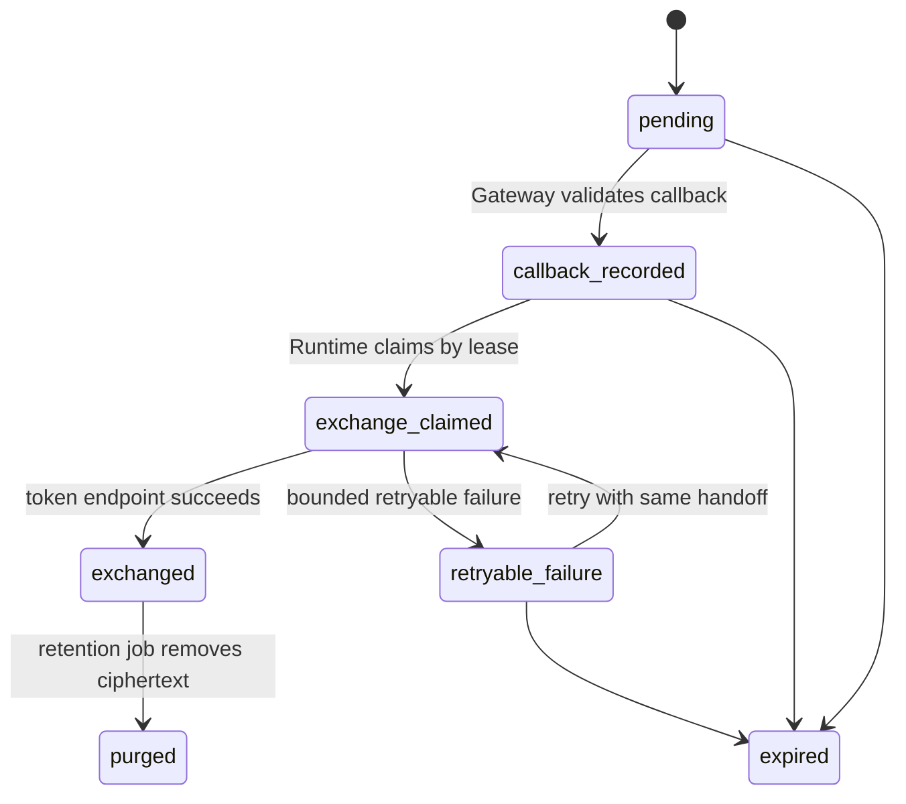

# Agent OAuth Callback Handoff

## Status

`foundation in progress; callback route blocked`。当前已具备 discovery、PKCE、密封 verifier、SQLC transaction、Core consume RPC、`000053` durable handoff persistence、SQLC 原子记录仓储、默认关闭的 Core record RPC、Gateway record client、未挂载的 callback handler、Runtime public-key envelope v1，以及受 `dipole-agent` mTLS caller 限制的 claim/complete/release RPC。原子记录将 transaction 校验、handoff 写入与 transaction consume 收敛在同一 MySQL transaction，并支持精确 callback 重放。record RPC 仅信任 `dipole-gateway`，owner 始终从可信 RequestContext 恢复。Core 仅在 `agent_oauth_callback_handoff_enabled=true` 与内部 RPC mTLS 同时成立时注入 handoff Store；默认配置保持关闭。它们不能单独构成可发布 callback。

### Provider exchange + token lifecycle（默认关闭）

2026-09-04 起，Runtime 侧补上了 provider exchange + token lifecycle 的**离线组合**闭环，仍**默认不装配**：`services/agent-runtime/src/index.ts` 与所有 bootstrap、Compose overlay、环境变量都没有引用；`OAuthCallbackRuntimeConfig` 依然默认 `enabled=false`，并且 `assertOAuthCallbackRuntimeUnavailable` 会在启用时明确抛错，直到有 approved provider 部署 profile。

- `OAuthCallbackProvider` 是唯一新增的接口：吃 executor 已经解开的 authorization code，只返回 `{ kind: "exchanged" | "retryable_failure" | "permanent_failure" }` 三种声明结果；不确定失败必须抛错以让 executor 保留 lease（沿用现有"outcome unknown 保留 lease"契约）。
- `DeterministicFakeOAuthCallbackProvider` 是测试双重：按 `sha256(authorizationCode)` 查 plan，`exchanged` / `permanent_failure` 幂等缓存，`retryable_failure` 每次都会真调，`throw` outcome 用来模拟不确定；无任何真实 HTTP。
- `TokenLifecycleStore`（进程内）承载 `pending_exchange → active → refreshed → { revoked | expired }` 状态机；terminal 后 `accessToken` / `refreshToken` 置 null 仅保留 metadata，非法转换 fail closed。**这只是 seam**——生产 lifecycle 必须由 Core 拥有的 SQLC 表 + KMS 承担；本切片没有新增 migration、没有新增 SQLC、没有跨进程持久化。
- `OAuthCallbackHandoffProviderProcessor` 把 provider + lifecycle wire 成 executor 认识的 `OAuthCallbackHandoffProcessor`：`exchanged` 写 active → `"completed"`；`retryable_failure` 不写 lifecycle → `"retryable_failure"`；`permanent_failure` 写 revoked → `"completed"`；lifecycle 已有 active / refreshed / revoked 时短路返回 `"completed"`，用于精确重放保护（Core 本身也拒绝二次 claim，此为进程内的第二道去重）。
- 端到端 6 场景（重复 notify、Worker 重启换 lease owner、claim 后 lease 超时、`exchanged` 精确重放被 Core 拒、`retryable_failure` 回滚后再次 claim 成功、`PERMISSION_DENIED` 时 Runtime 不打开 envelope / 不调 provider / 不写 lifecycle）在 `services/agent-runtime/src/mcp/oauth-callback-handoff-durable-runtime.test.ts` 用离线 fake Core store + fake provider 覆盖。

回滚：删除 feature branch 或忽略这批新文件即可；executor / claim / terminal / envelope / key source 未受修改，`index.ts` 与 Compose / env / 前端未接线。真实 provider adapter、Core-owned token lifecycle SQLC 表、Runtime 侧密钥轮换 / retention job、Gateway callback route 注册依然是 release 前置。

## Why The Gate Exists

当前 transaction consume 是单次条件更新。若 Gateway 成功 consume 后 Runtime 不可达，Gateway 手中的 authorization code 和密封 verifier 都无法可靠重试：Core 已拒绝第二次 consume，Runtime 也没有可恢复的 handoff record。

此外，OAuth callback 只能携带 `code`、`state` 与可选 issuer 参数。Gateway 已具备签名的 correlation v1 原语，可绑定 transaction、owner、issuer、redirect URI、state 摘要、browser-session 摘要与 expiry。该原语尚未由 cookie 签发或 callback handler 装配，Gateway 也尚未在 HTTP 请求中复核 issuer、redirect URI 与 browser binding，因此 HTTP callback 继续保持未注册。

这项门禁遵循 [RFC 9700](https://www.rfc-editor.org/rfc/rfc9700.html) 的 redirect-flow 与 PKCE 要求：精确 redirect URI、事务唯一的 S256 PKCE、可验证的 state/浏览器绑定，以及对多 Authorization Server 的 mix-up 防护。

## Required Contract

授权发起方必须产生 Gateway 可验证的 callback correlation。它可采用 HttpOnly、Secure、SameSite=Lax 的短时 cookie，或 Gateway 签名且加密的 opaque envelope；无论采用哪一种，Gateway 都必须在 callback 前恢复以下受信字段：

```text
transaction_id
owner_user_id
issuer
redirect_uri
expires_at
browser_session_binding
```

`state` 保持随机、高熵、单次使用值。Gateway 只将其 SHA-256 提交给 Core；任何 query、日志、审计、Kafka event、Temporal history 和浏览器 JSON response 均不得保存原始 `state`、authorization code、PKCE verifier 或 token。

Core 必须在 transaction record 中精确核对：

```text
transaction_id + owner + state_sha256 + issuer + redirect_uri + expiry
```

当前 Core consume RPC 已覆盖其中一部分。callback correlation v1 已作为 additive contract 落地；后续 handler 必须使用它完成 issuer mix-up、redirect URI 与 browser binding 验证，且不得复用未经验证的浏览器 session 字段。

## Durable Handoff State Machine

可靠 handoff 使用独立记录，不能以 Kafka 或 Gateway 内存代替。`000053` 已实现 `callback_recorded`、`exchange_claimed`、`exchanged` 以及受 expiry 限制的 lease claim/complete/release；Core 将三项 transition 仅暴露给 `dipole-agent` mTLS caller，缺 Store 时返回 `Unavailable`。Gateway callback 与默认 Runtime 装配仍未接线：



`callback_recorded` stores the authorization code only as a KMS/envelope-encrypted ciphertext for the Runtime key boundary, together with its SHA-256, transaction binding, expiry and idempotency key. Gateway cannot decrypt it. The code hash is unique per transaction; Runtime records token-exchange terminal state before exposing completion. A failed Runtime delivery therefore remains retryable without a second browser callback, while a duplicate callback cannot create a second exchange. The SQLC recording repository and its Core record RPC have Remote GPU MySQL coverage for first-write, exact-replay and unique-key rollback; their Compose gate remains disabled by default. Envelope v1 now fixes a hybrid RSA-OAEP-SHA256 + AES-256-GCM format and binding AAD in `contracts/agent-oauth-callback-handoff/v1`. An unmounted Runtime private-key file source validates key identity, ownership, permissions and RSA strength before a bounded use callback. Runtime key configuration/rotation and exchange seam remain release prerequisites.

## Boundaries

| Component | Allowed responsibility | Forbidden responsibility |
| --- | --- | --- |
| Gateway | callback correlation, state digest, Core claim, encrypted handoff write | verifier decryption, token exchange, token storage |
| Core | transaction ownership, conditional claim, durable handoff metadata | raw code logging, Runtime key access |
| Agent Runtime | KMS decrypt, token exchange, refresh/revoke lifecycle | browser callback authentication, plaintext persistence |
| Kafka / Temporal | low-sensitivity progress reference only | code, verifier, token or ciphertext payload |

The exact dual-channel transport and failure contract is maintained in
[`contracts/agent-oauth-callback-handoff/v1/TRANSPORT.md`](../../contracts/agent-oauth-callback-handoff/v1/TRANSPORT.md). It is a release prerequisite, not evidence that a callback route exists.

## Release Prerequisites

1. 将现有 versioned callback-correlation contract 装配为短时 browser-binding cookie，并在 handler 中完成 expiry、issuer mix-up 与 redirect URI 验证。
2. 已完成：Agent-owned SQLC handoff table、Runtime-only envelope ciphertext、code-hash uniqueness 与 lease/terminal transitions。
3. 已完成：Gateway 和 Runtime mTLS clients，且控制面不记录 request body 或敏感 headers。
4. Make Runtime token exchange idempotent and add refresh/revoke retention policy.
5. Add fault tests for duplicate callback, Runtime unavailable after claim, restart during exchange, expired correlation, wrong issuer, wrong redirect URI and wrong browser binding.
6. Complete a controlled provider-owner review before enabling any callback route.

## Current Safe Surface

The deployment surface remains unchanged: no OAuth HTTP callback route, no Runtime handoff receiver, no token exchange, no token persistence and no active Runtime configuration flag. Runtime contains unmounted claim and terminal clients; its mTLS-only claim response includes the owner binding needed to reconstruct envelope AAD, while `index.ts` does not construct either. The executor checks the durable handoff expiry and lease expiry before private-key use and again before the provider processor; either pre-effect failure releases the lease, while an unknown processor or completion outcome retains it. A Runtime replacement can claim only after Core accepts the earlier Runtime's explicit release; process-local notification deduplication is deliberately not the recovery authority. `ConsumeOAuthAuthorizationTransaction` and callback handoff RPCs remain internal; the latter require explicit Core Store injection, internal RPC mTLS and a `dipole-agent` caller.
