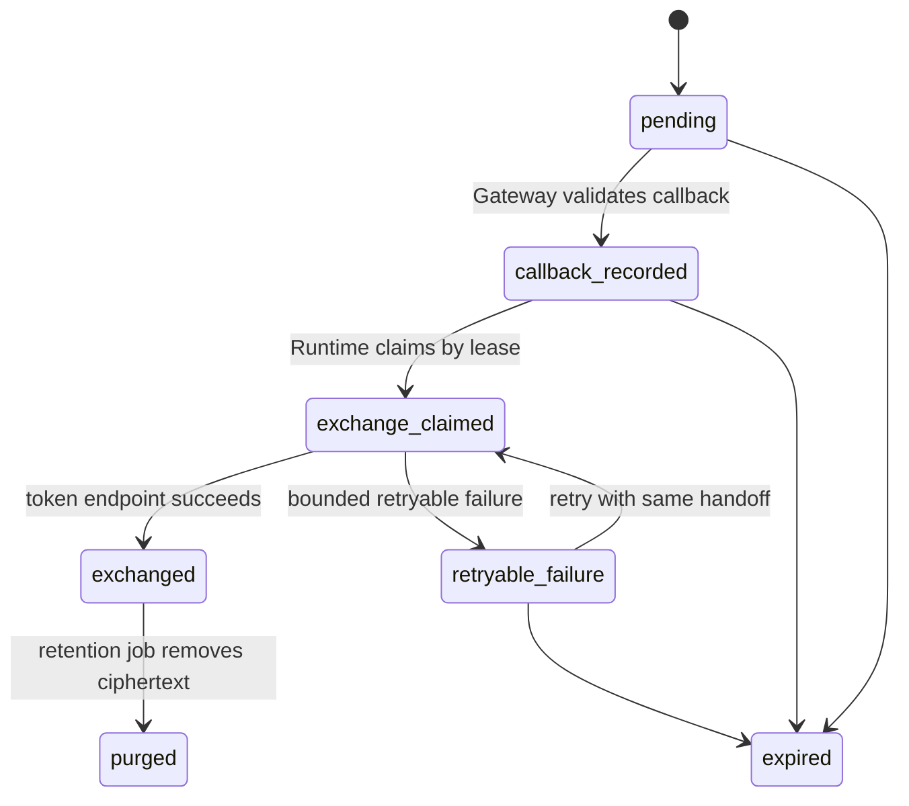

# Agent OAuth Callback Handoff

## Status

`foundation in progress; callback route blocked`。当前已具备 discovery、PKCE、密封 verifier、SQLC transaction、Core consume RPC、未装配 Gateway client、`000053` durable handoff persistence、Runtime public-key envelope v1，以及受 `dipole-agent` mTLS caller 限制的 claim/complete/release RPC。它们不能单独构成可发布 callback。

## Why The Gate Exists

当前 transaction consume 是单次条件更新。若 Gateway 成功 consume 后 Runtime 不可达，Gateway 手中的 authorization code 和密封 verifier 都无法可靠重试：Core 已拒绝第二次 consume，Runtime 也没有可恢复的 handoff record。

此外，OAuth callback 只能携带 `code`、`state` 与可选 issuer 参数。当前 RPC 要求 Gateway 从认证 context 提供 owner 与 transaction ID，尚未定义如何从 callback 的 opaque `state` 安全恢复这两个值。因此 HTTP callback 继续保持未注册。

这项门禁遵循 [RFC 9700](https://www.rfc-editor.org/rfc/rfc9700.html) 的 redirect-flow 与 PKCE 要求：精确 redirect URI、事务唯一的 S256 PKCE、可验证的 state/浏览器绑定，以及对多 Authorization Server 的 mix-up 防护。

## Required Contract

授权发起方必须产生 Gateway 可验证的 callback correlation。它可采用 HttpOnly、Secure、SameSite=Lax 的短时 cookie，或 Gateway 签名且加密的 opaque envelope；无论采用哪一种，Gateway 都必须在 callback 前恢复以下受信字段：

```text
transaction_id
owner_user_id
issuer
redirect_uri
expires_at
browser_session_binding
```

`state` 保持随机、高熵、单次使用值。Gateway 只将其 SHA-256 提交给 Core；任何 query、日志、审计、Kafka event、Temporal history 和浏览器 JSON response 均不得保存原始 `state`、authorization code、PKCE verifier 或 token。

Core 必须在 transaction record 中精确核对：

```text
transaction_id + owner + state_sha256 + issuer + redirect_uri + expiry
```

当前 Core consume RPC 已覆盖其中一部分。callback correlation 和 issuer mix-up 验证必须作为后续 additive contract 加入，而非复用未经验证的浏览器 session 字段。

## Durable Handoff State Machine

可靠 handoff 使用独立记录，不能以 Kafka 或 Gateway 内存代替。`000053` 已实现 `callback_recorded`、`exchange_claimed`、`exchanged` 以及受 expiry 限制的 lease claim/complete/release；Core 将三项 transition 仅暴露给 `dipole-agent` mTLS caller，缺 Store 时返回 `Unavailable`。Gateway callback 与默认 Runtime 装配仍未接线：



`callback_recorded` stores the authorization code only as a KMS/envelope-encrypted ciphertext for the Runtime key boundary, together with its SHA-256, transaction binding, expiry and idempotency key. Gateway cannot decrypt it. The code hash is unique per transaction; Runtime records token-exchange terminal state before exposing completion. A failed Runtime delivery therefore remains retryable without a second browser callback, while a duplicate callback cannot create a second exchange. Envelope v1 now fixes a hybrid RSA-OAEP-SHA256 + AES-256-GCM format and binding AAD in `contracts/agent-oauth-callback-handoff/v1`. An unmounted Runtime private-key file source validates key identity, ownership, permissions and RSA strength before a bounded use callback. Runtime key configuration/rotation, Store writer/reader and exchange seam remain release prerequisites.

## Boundaries

| Component | Allowed responsibility | Forbidden responsibility |
| --- | --- | --- |
| Gateway | callback correlation, state digest, Core claim, encrypted handoff write | verifier decryption, token exchange, token storage |
| Core | transaction ownership, conditional claim, durable handoff metadata | raw code logging, Runtime key access |
| Agent Runtime | KMS decrypt, token exchange, refresh/revoke lifecycle | browser callback authentication, plaintext persistence |
| Kafka / Temporal | low-sensitivity progress reference only | code, verifier, token or ciphertext payload |

The exact dual-channel transport and failure contract is maintained in
[`contracts/agent-oauth-callback-handoff/v1/TRANSPORT.md`](../../contracts/agent-oauth-callback-handoff/v1/TRANSPORT.md). It is a release prerequisite, not evidence that a callback route exists.

## Release Prerequisites

1. Add a versioned callback-correlation contract with browser-binding expiry and mix-up issuer verification.
2. Add an Agent-owned SQLC handoff table, KMS/envelope ciphertext, code-hash uniqueness and lease/terminal transitions.
3. Add Gateway and Runtime mTLS clients with no debug logging of request bodies or sensitive headers.
4. Make Runtime token exchange idempotent and add refresh/revoke retention policy.
5. Add fault tests for duplicate callback, Runtime unavailable after claim, restart during exchange, expired correlation, wrong issuer, wrong redirect URI and wrong browser binding.
6. Complete a controlled provider-owner review before enabling any callback route.

## Current Safe Surface

The deployment surface remains unchanged: no OAuth HTTP callback route, no Runtime handoff receiver, no token exchange, no token persistence and no active configuration flag. Runtime contains unmounted claim and terminal clients; its mTLS-only claim response includes the owner binding needed to reconstruct envelope AAD, while `index.ts` does not construct either. The executor checks the durable handoff expiry and lease expiry before private-key use and again before the provider processor; either pre-effect failure releases the lease, while an unknown processor or completion outcome retains it. A Runtime replacement can claim only after Core accepts the earlier Runtime's explicit release; process-local notification deduplication is deliberately not the recovery authority. `ConsumeOAuthAuthorizationTransaction` and callback handoff RPCs remain internal; the latter additionally require an explicitly injected Store and `dipole-agent` mTLS caller.
